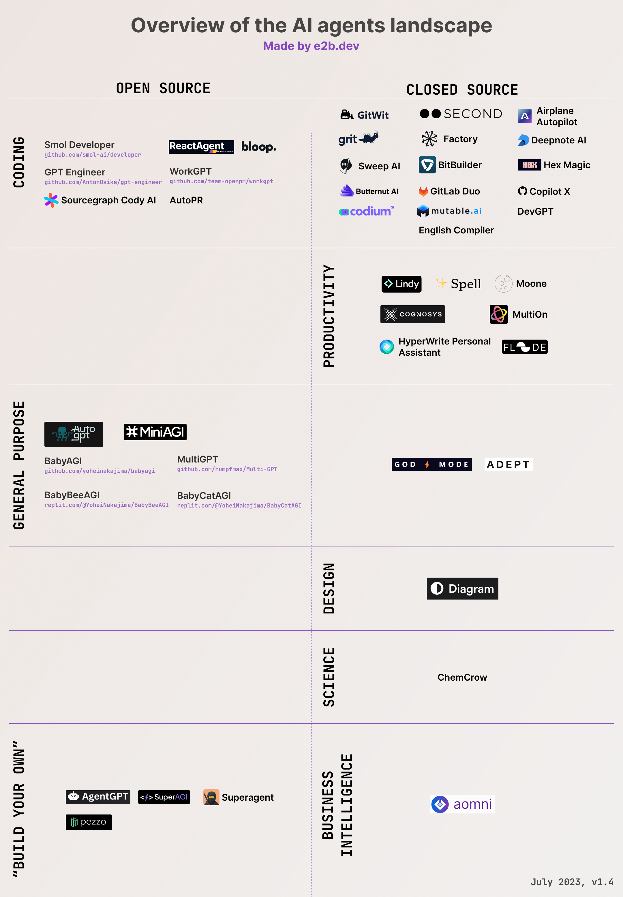

<!--
TBD:
- Add to visual:

- LLM Stack
- Promptly
- Devon
- vortic ai
- UFO
- GPT Swarm
- Eidolon
- NexusGPT
- Brain Soup
- L2MAC

Add to readme list:
- Codeium
- tinybio
- Semantix AI Agents - add when they have english version
- NoteWizard - only if it's AI agent - TBD test
- Postbot (TBD - check more)
	-->

<h1 align="center">
	🔮 Awesome AI Agents
	

		
		
	

</h1>
<h3 align="center">
  Add <a href="https://e2b.dev/docs?ref=awesome-sdks">Code Interpreter</a> to your AI App
</h3>

<h5 align="center">🌟 <a href="https://e2b.dev/ai-agents">See this list in web UI</a></h5>
<h5 align="center">👉 <a href="https://forms.gle/UXQFCogLYrPFvfoUA">Submit new product here</a></h5>

Welcome to our list of AI agents.
We structured the list into two parts:
- [Open source projects](#open-source-projects)
- [Closed-source projects and companies](#closed-source-projects-and-companies)
  
To filter the products by categories and use-cases, see the 🌟 [web version of this list](https://e2b.dev/ai-agents). 🌟

The list is done according to our best knowledge, although definitely not comprehensive. Check out also <a href="https://github.com/e2b-dev/awesome-sdks-for-ai-agents">the Awesome List of SDKs for AI Agents</a>.
Discussion and feedback appreciated! :heart:

## Have anything to add?
Create a pull request or fill in this [form](https://forms.gle/UXQFCogLYrPFvfoUA). Please keep the alphabetical order and in the correct category.

For adding AI agents'-related SDKs, frameworks and tools, please visit [Awesome SDKs for AI Agents](https://github.com/e2b-dev/awesome-sdks-for-ai-agents). This list is only for AI assistants and agents.

<!---
## Who's behind this?
This list is made by the team behind [e2b](https://github.com/e2b-dev/e2b). E2b is building AWS for AI agents. We help developers to deploy, test, and monitor AI agents. E2b is agnostic to your tech stack and aims to work with any tooling for building AI agents.
--->

## Check out E2B - Code Interpreting for AI apps
- Check out [Code Interpreter SDK](https://e2b.dev/docs?ref=awesome-sdk)
- Explore examples in [E2B Cookbook](https://github.com/e2b-dev/e2b-cookbook)
- Read our [docs](https://e2b.dev/docs?ref=awesome-sdks)
- Contact us at [hello@e2b.dev](mailto:hello@e2b.dev) or [on Discord](https://discord.gg/35NF4Y8WSE). Follow us on [X (Twitter)](https://twitter.com/e2b)

# Open-source projects

## [Adala](https://github.com/HumanSignal/Adala)
Adala: Autonomous Data (Labeling) Agent framework

### Category
General purpose, Build your own, Multi-agent

### Description

- **Reliable agents**: Built on ground truth data for consistent, trustworthy results.
- **Controllable output**: Tailor output with flexible constraints to fit your needs.
- **Specialized in data processing**: Agents excel in custom data labeling and processing tasks.
- **Autonomous learning**: Agents evolve through observations and reflections, not just automation.
- **Flexible and extensible runtime**: Adaptable framework with community-driven evolution for diverse needs.
- **Easily customizable**: Develop agents swiftly for unique challenges, no steep learning curve.

### Links
- [Documentation](https://humansignal.github.io/Adala/) 
- [Discord](https://discord.gg/QBtgTbXTgU)
- [GitHub](https://github.com/HumanSignal/Adala)

## [Agent4Rec](https://github.com/LehengTHU/Agent4Rec)
Recommender system simulator with 1,000 agents

### Category
General purpose, Build your own, Multi-agent

### Description
- Agent4Rec is a recommender system simulator that utilizes 1,000 LLM-empowered generative agents.
- These agents are initialized from the [MovieLens-1M](https://grouplens.org/datasets/movielens/1m/) dataset, embodying varied social traits and preferences.
- Each agent interacts with personalized movie recommendations in a page-by-page manner and undertakes various actions such as watching, rating, evaluating, exiting, and interviewing. 

### Links
- [Paper](https://arxiv.org/abs/2310.10108)

## [AgentForge](https://github.com/DataBassGit/AgentForge)
LLM-agnostic platform for agent building & testing

### Category
General purpose, Build your own, Multi-agent

### Description
- A low-code framework designed for the swift creation, testing, and iteration of AI-powered autonomous agents and Cognitive Architectures, compatible with various LLM models.
- Facilitates building custom agents and cognitive architectures with ease.
- Supports multiple LLM models including OpenAI, Anthropic's Claude, and local Oobabooga, allowing flexibility in running different models for different agents based on specific requirements.
- Provides customizable agent memory management and on-the-fly prompt editing for rapid development and testing.
- Comes with a database-agnostic design ensuring seamless extensibility, with straightforward integration with different databases like ChromaDB for various AI projects.

### Links
- [GitHub](https://github.com/DataBassGit/AgentForge)
- [Web](https://www.agentforge.net/)
- [Discord](https://discord.com/invite/ttpXHUtCW6)
- [X](https://twitter.com/AgentForge)

## [AgentGPT](https://agentgpt.reworkd.ai/)
Browser-based no-code version of AutoGPT

### Category
General purpose

### Description
- A no-code platform
- Process:
	- Assigning a goal to the agent
	- Witnessing its thinking process
	- Formulation of an execution plan
	- Taking actions accordingly
- Uses OpenAI functions
- Supports gpt-3.5-16k, pinecone and pg_vector databases
- Stack
	- Frontend: NextJS + Typescript
	- Backend: FastAPI + Python
	- DB: MySQL through docker with the option of running SQLite locally

<!--
### Features
- Uses OpenAI **functions**
- Supports gpt-3.5-16k, pinecone and pg_vector databases

### Stack
- Frontend: NextJS + Typescript
- Backend: FastAPI + Python
	- DB: MySQL through docker with the option of running SQLite locally
	-->

### Links
- [Documentation](https://docs.reworkd.ai/)
- [Website](https://agentgpt.reworkd.ai/)
- [GitHub](https://github.com/reworkd/AgentGPT)

<!-- This is a comment that appears only in the raw text -->

## [AgentPilot](https://github.com/jbexta/AgentPilot)
Build, manage, and chat with agents in desktop app

### Category
General purpose

### Description

- Integrated into Open Interpreter and MemGPT
- Group chats feature

### Links
- [GitHub](https://github.com/jbexta/AgentPilot)
- [X ](https://twitter.com/AgentPilotAI)
- 
  

## [Agents](https://github.com/aiwaves-cn/agents)

Library/framework for building language agents

### Category
General purpose, Build your own, Multi-agent

### Description
-   **Long-short Term Memory**: Language agents in the library are equipped with both long-term memory implemented via VectorDB + Semantic Search and short-term memory (working memory) maintained and updated by an LLM.
-   **Tool Usage**: Language agents in the library can use any external tools via  [function-calling](https://platform.openai.com/docs/guides/gpt/function-calling)  and developers can add customized tools/APIs  [here](https://github.com/aiwaves-cn/agents/blob/master/src/agents/Component/ToolComponent.py).
-   **Web Navigation**: Language agents in the library can use search engines to navigate the web and get useful information.
-   **Multi-agent Communication**: In addition to single language agents, the library supports building multi-agent systems in which language agents can communicate with other language agents and the environment. Different from most existing frameworks for multi-agent systems that use pre-defined rules to control the order for agents' action,  **Agents**  includes a  _controller_  function that dynamically decides which agent will perform the next action using an LLM by considering the previous actions, the environment, and the target of the current states. This makes multi-agent communication more flexible.
-   **Human-Agent interaction**: In addition to letting language agents communicate with each other in an environment, our framework seamlessly supports human users to play the role of the agent by himself/herself and input his/her own actions, and interact with other language agents in the environment.
-   **Symbolic Control**: Different from existing frameworks for language agents that only use a simple task description to control the entire multi-agent system over the whole task completion process,  **Agents**  allows users to use an  **SOP (Standard Operation Process)**  that defines subgoals/subtasks for the overall task to customize fine-grained workflows for the language agents.

### Links
- Author: [AIWaves Inc.](https:github.com/aiwaves-cn)
- [Paper](https://arxiv.org/pdf/2309.07870.pdf)
- [GitHub Repository](https://github.com/aiwaves-cn/agents)
- [Documentation](https://agents-readthedocsio.readthedocs.io/en/latest/index.html)
- [Tweet](https://twitter.com/wangchunshu/status/1702512370785100133)

## [AgentVerse](https://github.com/OpenBMB/AgentVerse)
Platform for task-solving & simulation agents

### Category
General purpose, Build your own, Multi-agent

### Description
- Assembles multiple agents to collaboratively accomplish tasks.
- Allows custom environments for observing or interacting with multiple agents.

### Links
- Paper: [AgentVerse: Facilitating Multi-Agent Collaboration and Exploring Emergent Behaviors](https://arxiv.org/abs/2308.10848)
- [Twitter](https://twitter.com/Agentverse71134)
- [Discord](https://discord.gg/gDAXfjMw)
- [Hugging Face](https://huggingface.co/spaces/AgentVerse/agentVerse)

## [AI Legion](https://github.com/eumemic/ai-legion)
Multi-agent TS platform, similar to AutoGPT

### Category
Multi-agent, Build-your-own

### Description
- An LLM-powered autonomous agent platform
- A framework for autonomous agents who can work together to accomplish tasks
- Interaction with agents done via console direct messages

### Links
- Author: [eumemic](https://github.com/eumemic)
- [Website](https://gpt3demo.com/apps/ai-legion)
- [GitHub](https://github.com/eumemic/ai-legion)
- [Twitter](https://twitter.com/dysmemic)

## [Aider](https://github.com/paul-gauthier/aider)
Use command line to edit code in your local repo

### Category
Coding, GitHub

### Description
- Aider is a command line tool that lets you pair program with GPT-3.5/GPT-4, to edit code stored in your local git repository
- You can start a new project or work with an existing repo. And you can fluidly switch back and forth between the aider chat where you ask GPT to edit the code and your own editor to make changes yourself
- Aider makes sure edits from you and GPT are committed to git with sensible commit messages. Aider is unique in that it works well with pre-existing, larger codebases

### Links  
- [Website](https://aider.chat/)
- Author: [Paul Gauthier](https://github.com/paul-gauthier) (Github)
- [Discord Invite](https://discord.com/invite/Tv2uQnR88V)

## [AIlice](https://github.com/myshell-ai/AIlice)
Create agents-calling tree to execute your tasks

### Category
General purpose, Personal assistant, Productivity

### Description
- "An Agent in the form of a chatbot independently plans tasks given in natural language and dynamically creates an agents calling tree to execute tasks.
- There is an interaction mechanism between agents to ensure fault tolerance.
- External interaction modules can be automatically built for self-expansion.

### Links  
- [GitHub](https://github.com/myshell-ai/AIlice)

## [AutoGen](https://github.com/microsoft/autogen)
Multi-agent framework with diversity of agents

### Category
General purpose, Build your own, Multi-agent

### Description
- A framework for developing LLM (Large Language Model) applications with multiple conversational agents.
- These agents can collaborate to solve tasks and can interact seamlessly with humans.
- It simplifies complex LLM workflows, enhancing automation and optimization.
- It offers a range of working systems across various domains and complexities.
- It improves LLM inference with easy performance tuning and utility features like API unification and caching.
- It supports advanced usage patterns, including error handling, multi-config inference, and context programming.

### Links
- Paper: [AutoGen: Enabling Next-Gen LLM Applications via Multi-Agent Conversation Framework](https://arxiv.org/pdf/2308.08155.pdf)
- [Discord](https://discord.gg/pAbnFJrkgZ)
- [Twitter thread describing the system](https://twitter.com/pyautogen)

## [AutoGPT](https://agpt.co/?utm_source=awesome-ai-agents)
Experimental attempt to make GPT4 fully autonomous

### Category
General purpose

### Description
- An experimental open-source attempt to make GPT-4 fully autonomous, with >140k stars on GitHub
- Chains together LLM "thoughts", to autonomously achieve whatever goal you set
- Internet access for searches and information gathering
- Long-term and short-term memory management
- Can execute many commands such as Google Search, browse websites, write to files, and execute Python files and much more
- GPT-4 instances for text generation
- Access to popular websites and platforms
- File storage and summarization with GPT-3.5
- Extensibility with Plugins
- "A lot like BabyAGI combined with LangChain tools"
- Features added in release 0.4.0
	- File reading
	- Commands customization
	- Enhanced testing

<!--
### Features added in release 0.4.0
- File reading
- Commands customization
- Enhanced testing
-->

### Links
- [Twitter](https://twitter.com/Auto_GPT/?utm_source=awesome-ai-agents)
- [GitHub](https://github.com/Significant-Gravitas/Auto-GPT/?utm_source=awesome-ai-agents)
- [Facebook](https://www.facebook.com/groups/1330282574368178/?utm_source=awesome-ai-agents)
- [Linkedin](https://www.linkedin.com/company/autogpt/?utm_source=awesome-ai-agents)
- [Discord](https://discord.gg/autogpt/?utm_source=awesome-ai-agents)
- Author: [Significant Gravitas](https://twitter.com/SigGravitas/?utm_source=awesome-ai-agents)

## [Automata](https://github.com/emrgnt-cmplxty/automata)
Generate code based on your project context

### Category
Coding

### Description
- Model: GPT 4
- Automata takes your project as a context, receives tasks, and executes the instructions seamlessly.
- Features
	- Automata aims to evolve into a fully autonomous, self-programming Artificial Intelligence system.
	- It's designed for seamless integration with all available agent platforms and LLM providers.
	- Utilizes the novel code search algorithm, SymbolRank, and associated tools to build superior coding intelligence.
	- Modular, fully configurable design with minimal reliance on external dependencies

### Links
- [GitHub](https://github.com/emrgnt-cmplxty/automata)
- [Docs](https://automata.readthedocs.io/en/latest/)
- Author: [Owen Colegrove](https://twitter.com/ocolegro)
<!--

### Features
- Automata aims to evolve into a fully autonomous, self-programming Artificial Intelligence system.
- It's designed for seamless integration with all available agent platforms and LLM providers.
- Utilizes the novel code search algorithm, SymbolRank, and associated tools to build superior coding intelligence.
- Modular, fully configurable design with minimal reliance on external dependencies.

-->

## [AutoPR](https://github.com/irgolic/AutoPR)
AI-generated pull requests agent that fixes issues

### Category
Coding, GitHub

### Description
- Triggered by adding a label containing AutoPR to an issue, AutoPR will:
	- Plan a fix
	- Write the code
	- Push a branch
	- Open a pull request

### Links
- [Discord](https://discord.com/invite/ykk7Znt3K6)

## [Autonomous HR Chatbot](https://github.com/stepanogil/autonomous-hr-chatbot)
Agent that answers HR-related queries using tools

### Category
HR, Business intelligence, Productivity

### Description
- A prototype enterprise application - an Autonomous HR Assistant powered by GPT-3.5.
- An agent that can answer HR related queries autonomously using the tools it has on hand.
- Powered by GPT-3.5
- Current tools assigned to the agent (with more on the way):
	- Timekeeping Policy
	- Employee Data
	- Calculator

### Links
- Medium: [Creating a (mostly) Autonomous HR Assistant with ChatGPT and LangChain’s Agents and Tools](https://pub.towardsai.net/creating-a-mostly-autonomous-hr-assistant-with-chatgpt-and-langchains-agents-and-tools-1cdda0aa70ef)
- [GitHub](https://github.com/stepanogil/autonomous-hr-chatbot)
- Author: [Stephen Bonifacio](https://twitter.com/Stepanogil)
- [YouTube demo](https://www.youtube.com/watch?v=id7XRcEIBvg&ab_channel=StephenBonifacio)
- [Blog post](https://pub.towardsai.net/creating-a-mostly-autonomous-hr-assistant-with-chatgpt-and-langchains-agents-and-tools-1cdda0aa70ef)

## [BabyAGI](https://github.com/yoheinakajima/babyagi)
A simple framework for managing tasks using AI

### Category
General purpose

### Description
- A pared-down version of the original [Task-Driven Autonomous Agent](https://twitter.com/yoheinakajima/status/1640934493489070080?s=20)
- Creates tasks based on the result of previous tasks and a predefined objective.
- The script then uses OpenAI's NLP capabilities to create new tasks based on the objective
- Leverages OpenAI's GPT-4, pinecone vector search, and LangChainAI framework
- Default model is OpenAI GPT3-turbo
- The system maintains a task list for managing and prioritizing tasks
- It autonomously creates new tasks based on completed results and reprioritizes the task list accordingly, showcasing the adaptability of AI-powered language models

### Links
- Paper: [Task-driven Autonomous Agent Utilizing GPT-4, Pinecone, and LangChain for Diverse Applications](https://yoheinakajima.com/task-driven-autonomous-agent-utilizing-gpt-4-pinecone-and-langchain-for-diverse-applications/)
- [Discord](https://discord.com/invite/TMUw26XUcg)
- [Founder's Twitter](https://twitter.com/yoheinakajima)
- [Twitter thread describing the system](https://twitter.com/yoheinakajima/status/1640934493489070080)

## [BabyBeeAGI](https://yoheinakajima.com/babybeeagi-task-management-and-functionality-expansion-on-top-of-babyagi/)
Task management & functionality BabyAGI expansion

### Category
General purpose, Productivity

### Description
- A more advanced version of the original BabyAGI code
- - Improves upon the original framework, by introducing a more complex task management prompt, allowing for more comprehensive analysis and synthesis of information
- Designed to handle multiple functions within one task management prompt
- Built on top of the GPT-4 architecture, resulting in slower processing speeds and occasional errors
- Provides a framework that can be further built upon and improved, paving the way for more sophisticated AI applications
- One of the significant differences between BabyAGI and BabyBeeAGI is the complexity of the task management prompt

### Links
- [Tweet](https://twitter.com/yoheinakajima/status/1652732735344246784)
- [GitHub](https://github.com/yoheinakajima/babyagi/blob/main/classic/BabyBeeAGI.py)
- [Replit](https://replit.com/@YoheiNakajima/BabyBeeAGI?v=1)
- Author: [@yoheinakajima](https://twitter.com/yoheinakajima) (Twitter)

## [BabyCatAGI](https://replit.com/@YoheiNakajima/BabyCatAGI)
BabyCatAGI is a mod of BabyBeeAGI

### Category
General purpose

### Description
- Just 300 lines of code
- This was built as a d iteration on the original BabyAGI code in a lightweight way. Differences to BabyAGI include the following:
	- Task Creation Agent runs once
	- Execution Agent loops through tasks
	- Task dependencies for pulling relevant results
	- Two tools: search tool and text completion
	- “Mini-agent” as tool
	- Search tool combines search, scrape, chunking, and extraction.
	- Results combined to create summary report

<!--
### How to use
- Fork this into a private Repl
- Add your OpenAI API Key (required) and SerpAPI Key (optional)
- Update the OBJECTIVE variable
- Press "Run" at the top.
-->

### Links
- [Tweet](https://twitter.com/yoheinakajima/status/1657448504112091136)
- [GitHub](https://github.com/yoheinakajima/babyagi/blob/main/classic/BabyCatAGI.py)
- [Replit](https://replit.com/@YoheiNakajima/BabyCatAGI)
- Author: [@yoheinakajima](https://twitter.com/yoheinakajima) (Twitter)

## [BabyDeerAGI](https://twitter.com/yoheinakajima/status/1666313838868992001)
Mod of BabyAGI with only ~350 lines of code

### Category
General purpose

### Category
General purpose

### Description
- Features
	- Parallel tasks (making it faster)
	- 3.5-turbo only (GPT-4 not required)
	- User input tool
	- Query rewrite in web search tool
	- Saves results

### Links
- [Tweet](https://twitter.com/yoheinakajima/status/1666313838868992001)
- [GitHub](https://github.com/yoheinakajima/babyagi/blob/main/classic/BabyDeerAGI.py)
- [Replit](https://replit.com/@YoheiNakajima/BabyDeerAGI)
- Author: [@yoheinakajima](https://twitter.com/yoheinakajima) (Twitter)

## [BabyElfAGI](https://twitter.com/yoheinakajima/status/1678443482866933760)
Mod of BabyDeerAGI, with ~895 lines of code

### Category
General purpose

### Description
- Features
	- Skills class allows for creation of new skills
	- 'Dynamic task list' example with vector search
	- Beta reflection agent
	- Can read, write, and review its own code

### Links
- [Tweet](https://twitter.com/yoheinakajima/status/1678443482866933760)
- [GitHub](https://github.com/yoheinakajima/babyagi/blob/main/classic/BabyElfAGI/main.py)
- [Replit](https://replit.com/@YoheiNakajima/BabyElfAGI)
- Author: [@yoheinakajima](https://twitter.com/yoheinakajima) (Twitter)

## [BabyCommandAGI](https://github.com/saten-private/BabyCommandAGI)
Test what happens when you combine CLI and LLM

### Category
General purpose, Coding

### Description
- gent designed to test what happens when you combine CLI and LLM, which are more traditional interfaces than GUI (created by @saten-private)
- An AI agent based on @yoheinakajima's [BabyAGI](https://github.com/yoheinakajima/babyagi) which executes shell commands
- Automatic Programming, Successfully created an app automatically just by providing feedback. The procedure can be found [here](https://twitter.com/saten_work/status/1674855573412810753).
- Automatic Environment Setup, Successfully installed a Flutter environment on Linux in a container, created the Flutter app, and launched it. The procedure can be found [here](https://twitter.com/saten_work/status/1667126272072491009).
- Aside from setting up the environment, it seems to be able to handle a bit of general tasks such as [Generating text, like poems, code, scripts, musical pieces, email, and letters, translating languages](https://anyaitools.com/babycommandagi/?utm_source=SocialAutoPoster&utm_medium=Social&utm_campaign=Twitter)
- There is a risk of breaking the environment. Please run in a virtual environment such as Docker.
- GPT-4 or higher is recommended

### Links
- [Founder's Twitter](https://twitter.com/saten_work)
- [Twitter thread describing the system](https://twitter.com/saten_work/status/1654571194111393793)

## [BabyFoxAGI](https://github.com/yoheinakajima/babyagi/tree/main/classic/babyfoxagi)
Mod of BabyAGI with a new parallel UI panel

### Category
General purpose

### Description
- A mod of BabyElfAGI, in a series of mods w the naming of Baby<animal>AGI in alphabetical order
- Self-improving task lists (FOXY method)
   	- By storing a final reflection at the end, and pulling the most relevant reflection to guide future runs, BabyAGI slowly generates better and better tasks lists
- Novel Chat UI w parallel tasks
  	- You can chat w BabyAGI! It has an experimental UI where the chat is separate from the tasks/output panel, allowing you to request multiple tasks in parallel
  	- The Chat UI can use a single skill quickly, or chain multiple skills together using a tasklist
-  New skills
	- 🎨 DALLE skill with prompt assist
 	- 🎶 Music player w Deezer
	- 📊 Airtable search (add your own table/base ID)
	- 🔍 Startup Analyst (example of beefy function call as a skill)
-  It’s own README

### Links
- [Author's Twitter](https://twitter.com/yoheinakajima)
- [Twitter thread describing the system](https://twitter.com/yoheinakajima/status/1697539193768116449)
- [Replit](https://replit.com/@YoheiNakajima)

## [BambooAI](https://github.com/pgalko/BambooAI)
Data exploration and analysis for non-programmers

### Category
Data analysis

### Description
- BambooAI runs in a loop (until user decides to end it).
- Allows mixing of different models with different capabilities, token costs and context windows for different tasks.
- Maintains the memory of previous conversations.
- Builds the prompts dynamically utilising relevant context from Pinecone vector DB.
- Offers a narrative or asks follow up questions if required.
- For codified responses, the task is broken down into a list of steps and a pseudo-code algorithm is built.
- Based on the algorithm, it ises the python code for dataset analysis, modeling or plotting.
- Debugs the code which then executes, auto-corrects if needs to, and displays the output to user.
- Ranks the final answers, and asks user for feedback.
- Builds a vector DB knowledge-base, based on the rank and the user feedback.

### Links
- [GitHub](https://github.com/pgalko/BambooAI)
- [Creators's Twitter](https://twitter.com/pgalko)

## [BeeBot](https://github.com/AutoPackAI/beebot)
Early-stage project for wide range of tasks

### Category
General purpose, Productivity

### Description
- "BeeBot is currently a work in progress and should be treated as an early stage research project. Its focus is not on production usage at this time."

	
### Links
- [GitHub](https://github.com/AutoPackAI/beebot)
- [Tweet](https://twitter.com/Douglas_Schon/status/1681094815021187072?s=20)

## [Blinky](https://github.com/seahyinghang8/blinky)
An open-source AI debugging agent for VSCode

### Category
Coding, Debugging

### Description
- Blinky is an open-source AI debugging agent for VSCode that uses LLMs to help identify and fix backend code errors (inspired by SWE-agent).
- Blinky leverages the VSCode API, Language Server Protocol (LSP), and print statement debugging to triangulate and address bugs in real-world backend systems.

	
### Links
- [VSCode Extension](https://marketplace.visualstudio.com/items?itemName=blinky.blinky)
- [Discord](https://discord.gg/d3AUNHDb)
- [GitHub](https://github.com/seahyinghang8/blinky)

## [Bloop](https://bloop.ai/)
AI code search, works for Rust and Typescript

### Category
Coding

### Description
- A GPT-4 powered semantic code search engine that uses an AI agent
- Precise code navigation
- Built on stack graphs and scope queries
- Fast code search and regex matching engine written in Rust
- Allows to find Code on Rust and Typescript
- Allows to stage changes
- The agent searches both your local and remote repositories with natural language, regex and filtered queries
- Bloop can be run via app (easy to download via GitHub)

### Links
- [GitHub](https://github.com/BloopAI/bloop)
- ["Getting started" guide](https://bloop.ai/docs/getting-started)
- [Bloop apps](https://github.com/BloopAI/bloop/releases)

## [BondAI](https://bondai.dev/)
Code interpreter with CLI & RESTful/WebSocket API

### Category
Coding

### Description
- A highly capable, autonomous AI Agent with an easy to use CLI, RESTful/WebSocket API, Pre-built Docker image and a robust suite of integrated tools.
- Support for all GPT-N, Embeddings and Dall-E OpenAI Models
- Support for Azure OpenAI Services
- Easy to use SDK for integration into any application
- Powerful **Code Interpreter** capabilities
- Powerful data query capabilities via Postgres DB integration
- Pre-built Docker image provides safe execution environment for code generation/execution
- Support for telephony applications (via BlandAI)
- Support for stock trading (via Alpaca Markets)
- Integrates with Gmail and Google Search
- Easy to install `pip install bondai`
- To start the CLI just run `bondai`
- To start the RESTful/WebSocket API just run `bondai --server`

### Links
- [BondAI Homepage/Documentation](https://bondai.dev)
- [Github Repository](https://github.com/krohling/bondai)
- [Docker Image](https://hub.docker.com/r/krohling/bondai)

## [bumpgen](https://github.com/xeol-io/bumpgen)
AI agent that keeps npm dependencies up-to-date

.gif>)

### Category
Coding

### Description
- Put dependency management and upgrades on autopilot
- bumpgen BUMPs an npm package's version up then GENerates the code fixes for breaking changes
- Supports gpt-4-turbo
- Easy install > `npm install -g bumpgen`
- Easy start > `bumpgen @tanstack/react-query 5.28.14`

### Links
- [Repo](https://github.com/xeol-io/bumpgen)
- [Docs](https://docs.xeol.io/bumpgen/home)

## [Cal.ai](https://cal.ai)
Open-source scheduling assistant built on Cal.com

### Category
Productivity

### Description
- Cal.ai can book meetings, summarize your week, and find time with others based on natural language.
- Responds flexibly to unseen tasks eg. "move my second-last meeting to tomorrow morning".
- Uses GPT-4 and LangChain Agent Executor under the hood.
- [GitHub](https://github.com/calcom/cal.com/tree/main/apps/ai)

### Links
- Authors: [Cal.com core team](https://github.com/calcom/cal.com/graphs/contributors), [Dexter Storey](https://github.com/dexterstorey), [Ted Spare](https://github.com/tedspare)

## [CAMEL](https://github.com/camel-ai/camel)
Architecture for “Mind” Exploration of agents

### Category
General purpose

### Description
- CAMEL is an open-source library designed for the study of autonomous and communicative agents.
1)AI user agent: give instructions to the AI assistant with the goal of completing the task.
2) AI assistant agent: follow AI user’s instructions and respond with solutions to the task
- CAMEL also has an open-source community dedicated to the study of autonomous and communicative agents

### Links
- [Web](https://www.camel-ai.org/)
- [Paper - CAMEL: Communicative Agents for “Mind”
Exploration of Large Scale Language Model Society](https://ghli.org/camel.pdf)
- [Colab demo](https://colab.research.google.com/drive/1AzP33O8rnMW__7ocWJhVBXjKziJXPtim?usp=sharing)
- [GitHub](https://github.com/camel-ai/camel)
- [Hugging face datasets](https://huggingface.co/camel-ai)
- [Slack](https://camel-kwr1314.slack.com/join/shared_invite/zt-1vy8u9lbo-ZQmhIAyWSEfSwLCl2r2eKA#/shared-invite/email)
- [Twitter](https://twitter.com/intent/follow?original_referer=https%3A%2F%2F1508613885-atari-embeds.googleusercontent.com%2F&ref_src=twsrc%5Etfw%7Ctwcamp%5Ebuttonembed%7Ctwterm%5Efollow%7Ctwgr%5ECamelAIOrg&screen_name=CamelAIOrg)
- Authors: Guohao Li∗ Hasan Abed Al Kader Hammoud* Hani Itani* Dmitrii Khizbullin, Bernard Ghanem

## [ChatArena](https://www.chatarena.org/)
A chat tool for multi agent interaction

### Category
Design, Build-your-own, SDK for AI apps, Multi-agent

### Description
- ChatArena (or Chat Arena) is a Multi-Agent Language Game Environments for LLMs. The goal is to develop communication and collaboration capabilities of AIs.
ChatArena provides:
- A general framework for building interactive environments for multiple large language models (LLMs). 
- A collection of pre-built or community-created  environments.
- User-friendly interfaces with both Web UI and commandline interfaces.

### Links
- [Web](https://www.chatarena.org/)
- [GitHub](https://github.com/Farama-Foundation/chatarena)
- [X](https://twitter.com/_chatarena)
- [Slack channel](https://chatarena.slack.com/join/shared_invite/zt-1t5fpbiep-CbKucEHdJ5YeDLEpKWxDOg#/shared-invite/email)
  

## [ChatDev](https://github.com/OpenBMB/ChatDev)
Communicative agents for software development

### Category
Coding, Multi-agent

### Description
- ChatDev is a virtual software company driven by a multitude of intelligent agents assuming different roles such as CEO, CPO, CTO, programmer, reviewer, tester, and art designer, each represented by unique icons.
- These agents collaborate in a structured organizational environment, fulfilling the company's mission to "revolutionize the digital world through programming." They engage in functional seminars focusing on design, coding, testing, and documentation.
- ChatDev aims to provide an accessible, modular, and extensible platform based on large language models, facilitating the study of collective intelligence in a controlled setting.
- The framework allows for extensive customization, empowering users to tailor the software development process, define phases, and establish specific roles within the virtual company.
- ChatDev is committed to open-source principles, encouraging contributions from the community and sharing advancements transparently.

### Links
- [Paper - ChatDev: Communicative Agents for Software Development](https://arxiv.org/abs/2307.07924)
- [Local demo](https://github.com/OpenBMB/ChatDev/blob/main/wiki.md#local-demo)
- [GitHub](https://github.com/OpenBMB/ChatDev)

## [ChemCrow](https://github.com/ur-whitelab/chemcrow-public)
LangChain agent for chemistry-related tasks

### Category
Science, Chemistry

### Description
- ChemCrow is an open source package for the accurate solution of reasoning-intensive chemical tasks
- It integrates 13 expert-design tools to augment LLM performance in chemistry and demonstrate effectiveness in automating chemical tasks
- Built with Langchain
- The LLM is provided with a list of tool names, descriptions of their utility, and details about the expected input/output. It is then instructed to answer a user-given prompt using the tools provided when necessary. The instruction suggests the model to follow the ReAct format - Thought, Action, Action Input, Observation. One interesting observation is that while the LLM-based evaluation concluded that GPT-4 and ChemCrow perform nearly equivalently, human evaluations with experts oriented towards the completion and chemical correctness of the solutions showed that ChemCrow outperforms GPT-4 by a large margin. This indicates a potential problem with using LLM to evaluate its own performance on domains that requires deep expertise. The lack of expertise may cause LLMs not knowing its flaws and thus cannot well judge the correctness of task results. (Source: [Weng, Lilian. (Jun 2023). LLM-powered Autonomous Agents". Lil’Log. https://lilianweng.github.io/posts/2023-06-23-agent/.](https://lilianweng.github.io/posts/2023-06-23-agent/))

### Links
- [Paper](https://arxiv.org/abs/2304.05376)
- [GitHub](https://github.com/ur-whitelab/chemcrow-public)
- [HackerNews Discussion](https://news.ycombinator.com/item?id=35607616)

## [Clippy](https://github.com/ennucore/clippy/)
Agent that can plan, write, debug, and test code

### Category
Coding

### Description
- The purpose of Clippy is to elop code for or with the user.
- It can plan, write, debug, and test some projects autonomously.
- For harder tasks, the best way to use it is to look at its work and provide feedback to it.

### Links
- [GitHub](https://github.com/ennucore/clippy/)
- Author: [Lev Chizhov](http://lev.la/) 

## [CodeFuse-ChatBot](https://github.com/codefuse-ai/codefuse-chatbot)
Agent serving entire SW development lifecycle

### Category
Coding

### Description
- An intelligent assistant serving the entire software development lifecycle, powered by a Multi-Agent Framework, working with DevOps Toolkits, Code&Doc Repo RAG, etc.

### Links
- [GitHub](https://github.com/codefuse-ai/codefuse-chatbot)

## [Cody by ajhous44](https://github.com/ajhous44/cody)
Query and navigate your codebase

### Category
Coding

### Description
- An AI assistant designed to let you interactively query your codebase using natural language.
- By utilizing vector embeddings, chunking, and OpenAI's language models, Cody can help you navigate through your code in an efficient and intuitive manner.

### Links
- [GitHub](https://github.com/ajhous44/cody)
- Author: [@ajhous44](https://github.com/ajhous44/) (Github)

## [Cody by Sourcegraph](https://docs.sourcegraph.com/cody)
Agent that writes code and answers your questions

### Category
Coding

### Description
An AI code assistant from Sourcegraph that writes code and answers questions for you by reading your entire codebase and the code graph.

### Links
- [GitHub](https://github.com/sourcegraph/sourcegraph/tree/main/client/cody)
- Author: [@sourcegraph](https://twitter.com/sourcegraph) (Twitter)

## [Continue](https://continue.dev/)
Open-source autopilot for software development

### Category
Coding

### Description
- An open-source autopilot for software development—bring the power of ChatGPT to VS Code
- Features:
	- Answer coding questions
   	- Edit in natural language
   	- Generate files from scratch

### Links
- [Website](https://continue.dev/)
- [GitHub](https://github.com/continuedev/continue)
- [Documentation](https://continue.dev/docs/intro)
- [Twitter](https://twitter.com/continuedev)

## [CrewAI](https://github.com/joaomdmoura/crewai)
Framework for orchestrating role-playing agents

### Category
Build-your-own, SDK for agents, Multi-agent

### Description
- Cutting-edge framework for orchestrating role-playing, autonomous AI agents.
- By fostering collaborative intelligence, CrewAI empowers agents to work together seamlessly, tackling complex tasks.
- Crew AI is a multi-agent framework built on LangChain, aiming to empower engineers to harness the collective power of AI agents. In contrast to traditional automation methods, Crew AI introduces a new approach to collaborative decision-making, enhanced creativity, and solving complex problems.
- The design philosophy of Crew AI advocates simplicity through modularity. Its main components include agents, tools, tasks, processes, and crews. Each agent is akin to a team member, possessing specific roles, background stories, goals, and memories. Through modular design, we make the intricate world of AI agents accessible, manageable, and more engaging.

### Links
- [GitHub](https://github.com/joaomdmoura/crewai)
- [Founder's X](https://twitter.com/joaomdmoura)
- [Blog post: How to use Crew AI](https://crewai.net/posts/how-to-use-crew-ai)
- [Crew AI Wiki with examples and guides](https://github.com/joaomdmoura/CrewAI/wiki)
- [Docs](https://github.com/joaomdmoura/CrewAI/wiki)
- [Discord](https://discord.com/invite/X4JWnZnxPb)

## [data-to-paper](https://github.com/Technion-Kishony-lab/data-to-paper)
AI-driven research from data to human-verifiable research papers

 

 
	
### Category
Science, Research, Multi-agent

### Description
[*data-to-paper*](https://arxiv.org/abs/2404.17605) is a framework for systematically navigating the power of AI to perform complete end-to-end 
scientific research, starting from raw data and concluding with comprehensive, transparent, and human-verifiable 
scientific papers.

Towards this goal, *data-to-paper* systematically guides interacting 
LLM and rule-based agents through the conventional scientific path, from annotated data, through creating 
research hypotheses, conducting literature search, writing and debugging data analysis code, 
interpreting the results, and ultimately the step-by-step writing of a complete research paper.

The *data-to-paper* framework is created as a research project to understand the 
capacities and limitations of LLM-driven scientific research, and to develop ways of harnessing LLM to accelerate 
research while maintaining, and even enhancing, key scientific values, such as transparency, traceability and verifiability, 
and while allowing scientist to oversee and direct the process 
[see also: [living guidelines](https://www.nature.com/articles/d41586-023-03266-1)].

### Links
- [GitHub](https://github.com/Technion-Kishony-lab/data-to-paper)
- [arXiv preprint](https://arxiv.org/abs/2404.17605)
- [Demo video](https://www.youtube.com/watch?v=Nt_460MmM8k)

## [Databerry](https://www.databerry.ai/)
(Pivoted to Chaindesk) No-code chatbot building

### Category
Build-your-own

### Description
- A super-easy no-code platform for creating AI chatbots trained on your own data
- After creating new agent, picking a model, data and other settings, they are ready to be deployed to website, Slack, Crisp, or Zapier
- Limit of agent in the free version
- Stack
	- Next.js
	- Joy UI
	- LangchainJS
	- PostgreSQL
	- Prisma
	- Qdrant
- Features
	- Streamline customer support, onboard new team members, and more
	- Load data from anywhere
	- No-code: User-friendly interface to manage your datastores and chat with your data
	- Secured API endpoint for querying your data
	- Auto sync data sources (coming soon)
	- Auto generates a ChatGPT Plugin for each datastore

### Links
- [Documentation](https://docs.chaindesk.ai/introduction)
- [Discord](https://discord.com/invite/FSWKj49ckX)
- [GitHub](https://github.com/gmpetrov/databerry)

## [DemoGPT](https://github.com/melih-unsal/DemoGPT)
Generates demo of a new app (of any purpose)

### Category
Build-your-own, General purpose

### Description
- DemoGPT leverages the power of Language Models (LLMs) to provide fast and effective demo creation for applications.
- Automates the prototyping process, making it more efficient and saving valuable time.
- Understands and processes the given prompts to generate relevant applications.
- Integrated with LangChain for generating application code through iterative parsing of LangChain's documentation with a "Tree of Transformations" (ToT) approach.
- The roadmap for DemoGPT includes constant updates and improvements based on user feedback and real-world application, working towards refining the technology and solving the hallucination problem.
- "We are planning to introduce features that will further enhance the application generation process, making it more user-friendly and efficient."

### Links
- [Github](https://github.com/melih-unsal/DemoGPT)
- [Website](https://www.demogpt.io/)
- [Twitter](https://twitter.com/demo_gpt)
- [Streamlit App](https://demogpt.streamlit.app/)
- [Hugging Face Space](https://huggingface.co/spaces/melihunsal/demogpt)

## [DevGPT](https://github.com/jina-ai/dev-gpt)
Team of virtual developers

### Category
Coding, Multi-agent

### Description
- "Tell your AI team what microservice you want to build, and they will do it for you. Your imagination is the limit!!
- Welcome to Dev-GPT, where we bring your ideas to life with the power of advanced artificial intelligence! Our automated development team is designed to create microservices tailored to your specific needs, making your software development process seamless and efficient. Comprised of a virtual Product Manager, Developer, and DevOps, our AI team ensures that every aspect of your project is covered, from concept to deployment.

### Links
- [Discord](https://discord.com/invite/AWXCCC6G2P)

## [Devika](https://github.com/stitionai/devika)
Agentic AI Software Engineer

### Category
Coding, general purpose

### Description
- Devika is an Agentic AI Software Engineer that can understand high-level human instructions, break them down into steps, research relevant information, and write code to achieve the given objective.
- Devika aims to be a competitive open-source alternative to Devin by Cognition AI.

### Links
- [GitHub](https://github.com/stitionai/devika)

## [Devon](https://github.com/entropy-research/Devon)
Open-source Devin alternative

### Category
Coding, general purpose

### Description
- Open-source alternative to Devin by Entropy research

### Links
- [GitHub](https://github.com/entropy-research/Devon)

## [DevOpsGPT](https://github.com/kuafuai/DevOpsGPT)
AI-Driven SW Development Automation Solution

### Category
Coding

### Description
Welcome to the AI Driven Software Development Automation Solution, abbreviated as DevOpsGPT. We combine LLM (Large Language Model) with DevOps tools to convert natural language requirements into working software. This innovative feature greatly improves development efficiency, shortens development cycles, and reduces communication costs, resulting in higher-quality software delivery.

### Features and Benefits
* Improved development efficiency: No need for tedious requirement document writing and explanations. Users can interact directly with DevOpsGPT to quickly convert requirements into functional software.
* Shortened development cycles: The automated software development process significantly reduces delivery time, accelerating software deployment and iterations.
* Reduced communication costs: By accurately understanding user requirements, DevOpsGPT minimizes the risk of communication errors and misunderstandings, enhancing collaboration efficiency between development and business teams.
* High-quality deliverables: DevOpsGPT generates code and performs validation, ensuring the quality and reliability of the delivered software.
* [Enterprise Edition] Existing project analysis: Through AI, automatic analysis of existing project information, accurate decomposition and development of required tasks on the basis of existing projects.
* [Enterprise Edition] Professional model selection: Support language model services stronger than GPT in the professional field to better complete requirements development tasks, and support private deployment.
* [Enterprise Edition] Support more DevOps platforms: can connect with more DevOps platforms to achieve the development and deployment of the whole process.

### Links
- [Creator Website](https://www.kuafuai.net/)
- [Demo Video](https://youtu.be/IWUPbGrJQOU)

## [dotagent](https://github.com/dot-agent/dotagent)
Deploy agents on cloud, PCs, or mobile devices

### Category
Build-your-own

### Description
- An agent management system that facilitates the creation of robust AI applications and experimental autonomous agents through a rich suite of developer tools.
- Enables the deployment of agents across multiple platforms including cloud, PCs, or mobile devices, and extends functionality through Python or plain English integrations.
- Advances prompt engineering with a powerful prompt compiler, offering a higher degree of control over Language Models, significantly optimizing the response generation process.
- Allows seamless export of agents into portable files for execution in any environment, along with an optional Agentbox feature for optimized computing resource management within a sandboxed environment.

### Links
- [YouTube video](https://www.youtube.com/watch?v=uE_fykl8AVI&ab_channel=FahdMirza)

## [Eidolon](https://eidolonai.com/)
Multi Agent SDK with pluggable, modular components

### Category
Build-your-own (agent-builing frameworks and platforms), SDK for AI apps

### Description
- Eidolon is an open source SDK for AI agents

### Links
- [Web](https://eidolonai.com/)
- [GitHub](https://github.com/eidolon-ai/eidolon)
- [LinkedIn](https://www.linkedin.com/company/august-data/)
- [Dave Brewster - LinkedIn](https://www.linkedin.com/in/dave-brewster-first/)
- [Ravi Ramachandran - LinkedIn](https://www.linkedin.com/in/ravi-nextlevelgtm/)
- [Luke Lalor - LinkedIn](https://www.linkedin.com/in/lukehlalor/)

## [English Compiler](https://github.com/uilicious/english-compiler)
Converting markdown specs into functional code

### Category
Coding

### Description
- OC AI based Compiler, for converting english based markdown specs, into functional code
- "We know that all great™ projects start with awesome™ detailed functional specifications. Which is typically written in English, or its many other spoken language alternatives.
- So what if, instead of writing code from functional specs, we simply compile it directly to code?
- Into a future, where we replace nearly everything, with just written text."

### Links
- [Creator's Twitter](https://twitter.com/picocreator)

## [evo.ninja](https://evo.ninja/)
AI agent that adapts its persona to achive tasks

### Category
General purpose, Research, Multi-agent

### Description
- What makes evo.ninja special is that it adapts itself in real-time, based on the tasks at hand.
- Evo utilizes pre-defined agent personas that are tailored to specific domains of tasks.
- Each iteration of evo's execution loop it will select and adopt the persona that fits the task at hand best.

### Links
- [Web](https://evo.ninja/)
- [GitHub](https://github.com/polywrap/evo.ninja/)
- [Discord](https://discord.com/invite/r3rwh69cCa)

## [FastAgency](https://fastagency.ai/latest/)
The fastest way to deploy multi-agent workflows

### Category
Build-your-own (agent-builing frameworks and platforms), SDK for AI apps, Multi-agent, Supports open-source models

### Description
- "FastAgency is an open-source framework designed to accelerate the transition from prototype to production for multi-agent AI workflows.
- For developers who use the AutoGen framework, FastAgency enables you to seamlessly scale Jupyter notebook prototypes into fully functional, production-ready applications.
- With multi-framework support, a unified programming interface, and powerful API integration capabilities, FastAgency streamlines the deployment process, saving time and effort while maintaining flexibility and performance.

### Links
- [Web](https://fastagency.ai/latest/)
- [GitHub](https://github.com/airtai/fastagency)

## [Flowise](https://flowiseai.com/)
Low code Agent builder

### Category
Build-your-own (agent-builing frameworks and platforms)

### Description
- Flowise is an open source low-code tool for developers to build customized LLM orchestration flow & AI agents

### Links
- [Web](https://flowiseai.com/)
- [GitHub](https://github.com/FlowiseAI/Flowise)
- [X (Twitter)](https://x.com/FlowiseAI)
- [LinkedIn](https://www.linkedin.com/company/flowiseai/)

## [Friday](https://github.com/amirrezasalimi/friday/)
AI developer assistant for Node.js

### Category
Coding

### Description
- A developer assistant able to make whole nodejs project with unlimited prompts
- Provides a core prompt for building the foundation of your application
- Allows you to add unlimited sections, each of which is a prompt representing a specific part of your app
- Features
	- Friday utilizes GPT-4 for AI assistance, but it has been tested and optimized with GPT-4-32k for improved speed and better results.
	- It requires 2 small requests for your app's base and 1 request per section you provide.
	- Friday employs esbuild behind the scenes for every app created by it.

### Links
- **Author:** [Amirreza Salimi](https://twitter.com/amirsalimiiii)

## [GeniA](https://github.com/genia-dev/GeniA)
Engineering platform engineering AI team member

### Category
Coding

### Description
- GeniA is able to work along side you on your production enviroment, executing tasks on your behalf in your dev & cloud environments, AWS/k8s/Argo/GitHub etc.
- Allows you to enhance the platform by integrating your own tools and APIs.
- Slack App Bot integration.
- Supports GPT-3.5 & GPT-4.

### Links
- Authors: [Uri Shamay](https://github.com/cmpxchg16), [Shlomi Shemesh](https://github.com/shlomsh)

## [Godmode](https://godmode.space/)
Inspired by AutoGPT and BabyAGI, with nice UI

### Category
General purpose

### Description
- Godmode is a project inspired by Auto-GPT and BabyAGI, conducting  various kinds of tasks via nice UI
- A web platform inspired by AutoGPT and BabyAGI
- What it can do:
	- Order your coffee at Starbucks
	- Perform market analysis
	- Find and negotiate a lease
- Supports GPT-3.5 & GPT-4

### Links
- [GitHub](https://github.com/FOLLGAD/Godmode-GPT)
- Authors: [Emil Ahlbäck](https://twitter.com/emilahlback), [Lonis](https://twitter.com/_Lonis_)
- [Discord](https://discord.com/invite/vSzCcDDwz3)
- [Tweet](https://twitter.com/_Lonis_/status/1646641412182536196)

## [GPT Discord](https://github.com/Kav-K/GPTDiscord)
The ultimate AI agent integration for Discord

### Category
Content creation, Productivity, General purpose, Discord

### Description
- GPT Discord is a robust, all-in-one GPT interface for Discord.
- GPT Discord supports everything from multi-modality image understanding, code interpretation, advanced data analysis, Q&A on your own documents, internet-connected chat with Wolfram Alpha and Google access, AI-moderation, image generation with DALL-E, and much more!
- Featuring code execution and environment manipulation by E2B
- 
- LLMs/model providers supported:
  - OpenAI models

### Links
- [GitHub](https://github.com/Kav-K/GPTDiscord)
- [Kaveen Kumarasinghe - founder of GPT Discord - website](https://kaveenk.com/)
- [Kaveen Kumarasinghe - founder of GPT Discord - LinkedIn](https://www.linkedin.com/in/kaveenk/)

  

## [GPT Engineer](https://gptengineer.app/)
Generates entire codebase based on a prompt

### Category
Coding

### Description
GPT Engineer is an AI agent that generates an entire codebase based on a prompt.
- Model: GPT 4
- Specify your project, and the AI agent asks for clarification, and then constructs the entire code base
- Features
	- Made to be easy to adapt, extend, and make your agent learn how you want your code to look. It generates an entire codebase based on a prompt
	- You can specify the "identity" of the AI agent by editing the files in the identity folder
	- Editing the identity and evolving the main prompt is currently how you make the agent remember things between projects
	- Each step in steps.py will have its communication history with GPT4 stored in the logs folder, and can be rerun with scripts/rerun_edited_message_logs.py

### Links
- [Web](https://gptengineer.app)
- [GitHub](https://github.com/AntonOsika/gpt-engineer)
- [Discord](https://discord.com/invite/8tcDQ89Ej2)
- Author: [Anton Osika](https://twitter.com/antonosika)
- [Twitter review by @Attack](https://twitter.com/Attack/status/1671165869064609792)

## [GPT Migrate](https://github.com/0xpayne/gpt-migrate)
Migrate codebase between frameworks/languages

### Category
Coding

### Description
GOT Migrate easily migrates your codebase from one framework or language to another.
- Pick from different LLMs
- Ability to allow GPT Migration to generate and run unit tests for the new codebase
- Ability to select source and target language of the migration
- Ability to customize the agent's workflow (setup -> migrate -> test)
- GPT Migrate team is working on adding [benchmarks](https://github.com/0xpayne/gpt-migrate#-benchmarks) for the agent

### Links
- [Website](https://gpt-migrate.com/)
- Author: [Josh Payne](https://twitter.com/joshpxyne)
- [Announcement](https://twitter.com/joshpxyne/status/1675254164165910528)

## [GPT Pilot](https://github.com/Pythagora-io/gpt-pilot)
Code the entire scalable app from scratch

### Category
Coding

### Description
GPT Pilot is an AI agent that codes the entire app as you oversee the code being written
- Dev tool that writes scalable apps from scratch while the developer oversees the implementation
- A research project to see how can GPT-4 be utilized to generate fully working, production-ready, apps
- The main idea is that AI can write most of the code for an app (maybe 95%) but for the rest 5%, a developer is and will be needed until we get full AGI

### Links
- [GitHub](https://github.com/Pythagora-io/gpt-pilot)
- [Discord](https://discord.com/invite/HaqXugmxr9)

## [GPT Researcher](https://github.com/assafelovic/gpt-researcher)
Agent that researches entire internet on any topic

### Category
Research, Science

### Description
GPT Researcher is a GPT-based autonomous agent that does online comprehensive research on any given topic
- Can produce detailed, factual and unbiased research reports
- Offers customization options for focusing on relevant resources, outlines, and lessons
- Addresses issues of speed and determinism, offering a more stable performance and increased speed through parallelized agent work, as opposed to synchronous operation
- Inspired by AutoGPT and the Plan-and-Solve paper
- The main idea is to run "planner" and "execution" agents, whereas the planner generates questions to research, and the execution agents seek the most related information based on each generated research question

### Links
- [Website](https://tavily.com/)
- [Discord](https://discord.com/invite/2pFkc83fRq)
- Author: [Assaf Elovic](https://twitter.com/assaf_elovic)

## [GPT Runner](https://github.com/nicepkg/gpt-runner)
Agent that converses with your files

### Category
Research, Science

### Description
- Conversation with your files which selected by you, no embedding, no vector database!
- It's also a AI Prompt Storybook. You can use it to manage some AI preset with your team. It support any IDE and language developer. We provide cli to run web and VSCode extension, Jetbrains plugin is coming soon.
- Private first, all data is local.
- We support both OpenAI and Anthropic (Claude-2)
- It support support for multiple languages.

### Links
- [Website](https://github.com/nicepkg/gpt-runner)
- Author: [Jinming Yang](https://github.com/2214962083)

## [GPTSwarm](https://gptswarm.org/)
Language Agents as Optimizable Graphs

### Category
Build-your-own (agent-builing frameworks and platforms), General purpose, Multi-agent

### Description
- 🐝 GPTSwarm is a graph-based framework for LLM-based agents, providing two high-level features:
  - It lets you build LLM-based agents from graphs.
  - It enables the customized and automatic self-organization of agent swarms with self-improvement capabilities.
- Various human-designed prompt engineering techniques have been proposed to improve problem solvers based on Large Language Models (LLMs), yielding many disparate code bases. We unify these approaches by describing LLM-based agents as computational graphs. Each node implements a function to process multimodal data or query other LLMs. Each edge describes the information flow between operations and agents. Graphs can be recursively combined into larger composite graphs representing hierarchies of inter-agent collaboration. Our novel automatic graph optimizers (1) refine node-level LLM prompts (node optimization) and (2) improve agent orchestration by changing graph connectivity (edge optimization). Experiments demonstrate that our framework can be used to efficiently develop, integrate, and automatically improve diverse LLM agents.

### Links
- [Web](https://gptswarm.org/)
- [GitHub](https://github.com/metauto-ai/GPTSwarm)
- [Founder's X (Twitter)](https://twitter.com/MingchenZhuge)

## [IX](https://github.com/kreneskyp/ix)
Agents building, debugging, and deploying platform

### Category
Build your own, Multi-agent

### Description
IX is a platform for building, debugging, and deploying collaborative Agents and cognitive workflows.
-IX is a LangChain-based agent platform that includes all the tools to build and deploy fleets of agents that
collaborate to complete tasks. IX is both an editor and a runtime. The editor is a no-code graph style editor for
the design of agents, chains, tools, retrieval functions, and collaborative workflows.

- Intuitive graph style no-code editor.
- Horizontally scaling agent worker fleet.
- Multi-user, multi-agent chat interface.
- Smart input auto-completes `@mentions` and `{file}` references.
- Supports Chroma and other vector databases for document search.
- Supports OpenAI API, Anthropic, PaLM, and LLama based models.
- Component library is easily extended.
- Powered by LangChain

### Links

- [Youtube](https://www.youtube.com/watch?v=hAJ8ectypas&list=PLR8AMvFecu1hyMHFzaehbfFcMcECMafVs)
- [Discord](https://discord.gg/jtrMKxzZZQ)
- [Author's Twitter](https://twitter.com/kreneskyp)

## [JARVIS](https://github.com/microsoft/JARVIS)
System that connects LLMs with the ML community

### Category
General purpose

### Description
JARVIS is a system to connect LLMs with the ML community.
- Task Planning: Using ChatGPT to analyze the requests of users to understand their intention, and disassemble them into possible solvable tasks.
- Model Selection: To solve the planned tasks, ChatGPT selects expert models hosted on Hugging Face based on their descriptions.
- Task Execution: Invokes and executes each selected model, and returns the results to ChatGPT.
- Response Generation: Use ChatGPT to integrate the prediction of all models, and generate responses.

### Links

- [Paper](https://arxiv.org/abs/2303.17580)

## [Langroid](https://github.com/langroid/langroid)
Multi-agent framework for building LLM apps

### Category
General purpose, Build your own

### Description

`Langroid` is an intuitive, lightweight, extensible and principled
Python framework to easily build LLM-powered applications.
You set up Agents, equip them with optional components (LLM,
vector-store and methods), assign them tasks, and have them
collaboratively solve a problem by exchanging messages.
This Multi-Agent paradigm is inspired by the
[Actor Framework](https://en.wikipedia.org/wiki/Actor_model)
(but you do not need to know anything about this!).

`Langroid` is a fresh take on LLM app-development, where considerable thought has gone
into simplifying the developer experience; it does not use `Langchain`.

- Works with most commercial/remote and open/local LLMs.
- Set up Multi-agent, multi-LLM system: use stronger LLMs for agents requiring strong reasoning and instruction-following, and delegate simpler tasks to weaker/local LLMs. 
- Supports OpenAI function-calling as well as native equivalent called `ToolMessage`, which works with LLMs that 
  do not have built-in function-calling. Simply specify structure as a (nested) Pydantic object.
- Batteries-included: vector-databases for RAG (Retrieval-Augmented Generation), caching, logging/observability.
- Specialized agents available: `DocChatAgent`, `SQLChatAgent`, `TableChatAgent` (for tabular data, e.g. csv/dataframes).
- `DocChatAgent` handles text, PDF, Docx files/URLS, and has state-of-the art techniques 
   for retrieval combining lexical and semantic search.
- Documentation: https://langroid.github.io/langroid/

## [Lemon Agent](https://github.com/felixbrock/lemon-agent)
Plan-Validate-Solve agent for workflow automation

### Category
Productivity, Coding

### Description
Lemon agent is a Plan-Validate-Solve (PVS) Agent for accurate, reliable and reproducable workflow automation
- A standalone supervised Plan and Solve Agent specialized on performing read and write operations on various tools like GitHub, HubSpot or Airtable _(ACL 2023 Paper "[Plan-and-Solve Prompting: Improving Zero-Shot Chain-of-Thought Reasoning by Large Language Models](https://arxiv.org/abs/2305.04091)")_
- **Separation of tasks and human-in-the-loop interactions**: Lemon Agent is currently holding a Planner Agent and a Solver Agent to keep the agents focussed and increase accuracy. We are planning on adding additional agents real soon. In addition, Lemon Agent will ask for approval at relevant workflow steps to make sure the intended actions are executed.
- **Unlimited configuration options**: Lemon Agent gives you unlimited configuration options (see example here) when defining your workflow. For instance, you can tell Lemon Agent to ask for permission before executing a workflow step or to drop a 🧔‍♀️ dad joke every time the model executes a workflow step.
- **UI flexibility**: Build any UI on top or engage with Lemon Agent via the built-in CLI.
- **[Soon] Model & framework agnostic operations**: Lemon Agent is a standalone agent, but can easily be integrated into frameworks like LangChain and be used with any model.
- **Bonus**: Identify weak spots in your agent’s decision-making capabilities and move to a more deterministic behavior by further configuring your Lemon Agent workflows. **(.html file that can be run without any additional installation)**

### Links

- [Discord](https://discord.gg/fWU4rDYSxw)
- [Author's Twitter](https://twitter.com/felixbrockm)

## [LLM Agents](https://github.com/mpaepper/llm_agents)
Library for building agents, using tools, planning

### Category
Coding

### Description
A minimalistic library for building agents that leverage large language models to automate tasks through a loop of commands and tool integrations.
- Executing Python code in a REPL environment.
- Conducting searches on Google and Hacker News.
- Iterating through a cycle of Thought, Action, Observation, and New Thought based on the output of integrated tools.
- Dynamically appending new information to the prompt for informed decision-making by the agent.

### Links

- [GitHub](https://github.com/mpaepper/llm_agents)
- [Blog](https://www.paepper.com/blog/posts/intelligent-agents-guided-by-llms/)

## [LLM Stack](https://llmstack.ai/)
No-code platform to build LLM Agents

### Category
Build-your-own, no-code, web UI

### Description
- LLM Stack is a no-code platform to build LLM Agents, workflows and applications with your data
- LLMStack supports all major model providers, like OpenAI, Cohere, Stability AI, Hugging Face, and more. Easily use these models to build powerful apps.
- With LLM Stack, you can build generative AI agents like AI SDRs, Research Analysts, RPA Automations etc., without writing any code. Connect agents to your internal or external tools, search the web or browse the internet with agents.
- LLMs/model providers supported
  - OpenAI
  - Cohere
  - Stability AI
  - Hugging Face

### Links
- [Web](https://llmstack.ai/)
- [GitHub](https://github.com/trypromptly/LLMStack)
- [Blog](https://llmstack.ai/blog)

## [Local GPT](https://github.com/PromtEngineer/localGPT)
Chat with documents without compromising privacy

### Category
Research, Data analysis, General purpose

### Description
LocalGPT is an open-source initiative that allows you to converse with your documents without compromising your privacy. Inspired by privateGPT, allows using your own documents as an information source

- Chat with your documents on your local device using GPT models. No data leaves your device and 100% private
- With everything running locally, you can be assured that no data ever leaves your computer
- Dive into the world of secure, local document interactions with LocalGPT
- Most of the description on readme is inspired by the original privateGPT
- Model: Vicuna-7B
- Using InstructorEmbeddings
- Both Embeddings as well as LLM will run on GPU. It also has CPU support if you do not have a GPU
- Built with Langchain

### Links

- [GitHub](https://github.com/PromtEngineer/localGPT)
- [Subreddit](https://www.reddit.com/r/LocalGPT/)
- [YouTube - LocalGPT: OFFLINE CHAT FOR YOUR FILES [Installation & Code Walkthrough]](https://www.youtube.com/watch?v=MlyoObdIHyo&ab_channel=PromptEngineering)

## [Loop GPT](https://github.com/farizrahman4u/loopgpt/tree/main)
Re-implementation of AutoGPT as a Python package

 

 

### Category
General purpose

### Description
Loop GPT is a re-implementation of the popular Auto-GPT project as a proper python package, written with modularity and extensibility in mind
- Languages: Python
- Default model: GPT-3.5-turbo (also possible with GPT-4)
- Modular Auto-GPT Framework
- Plug N Play" API - Extensible and modular "Pythonic" framework, not just a command line tool
- Features
	- "Easy to add new features, integrations and custom agent capabilities, all from python code, no nasty config files!"
	- "Minimal prompt overhead - Every token counts. We are continuously working on getting the best results with the least possible number of tokens."
	- "Human in the Loop - Ability to "course correct" agents who go astray via human feedback."
	- "Full state serialization - can save the complete state of an agent, including memory and the states of its tools to a file or python object. No external databases or vector stores required (but they are still supported)!"

<!--
### Features
- "Easy to add new features, integrations and custom agent capabilities, all from python code, no nasty config files!"
- "Minimal prompt overhead - Every token counts. We are continuously working on getting the best results with the least possible number of tokens."
- "Human in the Loop - Ability to "course correct" agents who go astray via human feedback."
- "Full state serialization - can save the complete state of an agent, including memory and the states of its tools to a file or python object. No external databases or vector stores required (but they are still supported)!"

-->

## [L2MAC](https://github.com/samholt/l2mac)
Agent framework able to produce large complex codebases and entire books

 

### Category
Multi-agent, Coding, Build your own

### Description
L2MAC is a multi-agent generation framework that, a single input prompt can generate an extensive unbounded output, such as an entire codebase or an entire book.
- L2MAC can create near unbounded outputs that align exactly with the user input prompt over very long generation tasks
- It achieves strong empirical performance of state-of-the-art generation for large codebase tasks and is in the top 3 for the HumanEval coding global benchmark. As L2MAC can detect invalid code and failing unit tests when generating code and automatically error corrects them.
- Internally persists a complete file-store memory that enables LLM agents to read files and write to files, creating a large output over many iterations
- It can be instructed to follow an exact prompt program
- As it generates the output one part at a time, it enables an LLM with a fixed context token limit to be bypassed
- The paper, peer-reviewed and recently accepted and published at ICLR 2024, introduces L2MAC.

### Links  
- [GitHub](https://github.com/samholt/l2mac)
- [Discord](https://discord.gg/z27CxnwdhY)
- [Twitter](https://twitter.com/samianholt)
- [Paper - L2MAC: Large Language Model Automatic Computer for Extensive Code Generation](https://arxiv.org/abs/2310.02003)

## [Maige](https://maige.app)
Natural-language workflows for your GitHub repo.

 

### Category
Coding, Productivity, Debugging, Multi-agent
	
### Description
- Maige is a codebase agent that runs when new issues and pull requests come up. Its core features are labelling, assigning, and answering questions.
- Maige can search the entire codebase, spin up a sandbox to run scripts, and even write basic code.

### Links  
- [Web](https://maige.app)
- [GitHub](https://github.com/RubricLab/maige)
- [Video - testing Maige](https://www.youtube.com/watch?v=YN-y-iweZTc&ab_channel=TerezaTizkova)
- [Interview - founder about building Maige](https://e2b.dev/blog/building-open-source-codebase-copilot-with-code-execution-layer)
- [X (Twitter)](https://twitter.com/rubriclabs)
- [Founder's X - Ted Spare](https://twitter.com/tedspare)

## [Magick](https://www.magickml.com/)
AIDE for creating, deploying, monetizing agents

 

### Category
Coding, SDK for agents, Build-your-own

	
### Description
Magick is an AIDE for creating, deploying, scaling, and monetizing useful AI agents, and prompt chaining.
- A full suite, model agnostic AIDE for creating, deploying, scaling, and monetizing useful AI agents, and prompt chaining. 
- Magick allows to build things like BabyAGI within an hour.  You can watch the graph executing in real time, watch the thought process as it executes, and understand the flow.
- "Visual development of autonomous agents is incoming.  We have built Magick specifically for the rapid development of cognitive architecture and scalable event-driven autonomous agents."

### Links  
- [Web](https://www.magickml.com/)
- [GitHub](https://github.com/Oneirocom/Magick)
- [X](https://twitter.com/magickml)
- [Discord](https://discord.com/invite/7Xx5DmbJCe)
- [LinkedIn](https://www.linkedin.com/company/magickml/)
- [Founder's LinkedIn - Jesse Alton](https://www.linkedin.com/in/mrmetaverse/)
- [Founder's LinkedIn - Michael Sharpe](https://www.linkedin.com/in/michaelpsharpe/)

## [MemFree](https://github.com/memfreeme/memfree)
Open Source Hybrid AI Search Engine

 

### Category
Open Source, AI Search, Build your own

### Description

Open Source Hybrid AI Search Engine, Instantly Get Accurate Answers from the Internet, Bookmarks, Notes, and Docs.

- One-Click Chrome Bookmarks Sync and Index
- Support multiple traditional search engines as source
- Self-hosted Super Fast Serverless Vector Database
- Self-hosted Super Fast Local Embedding and Rerank Service
- Full Code Open Source
- One-Click Deployment On Production

### Links  
- [Documentation](https://www.memfree.me/docs)
- [Discord](https://discord.com/invite/7QqyMSTaRq)
- [Twitter](https://twitter.com/ahaapple2023)
- [Website](https://www.memfree.me)

## [MemGPT](https://github.com/cpacker/MemGPT)
Memory management system, providing context to LLM

 

### Category
Memory management, Data analysis
	
### Description
- A system that intelligently manages different memory tiers in LLMs to effectively provide the extended context within the LLM's limited context window. 
- Chat with your data - talk to your local files or SQL database
- Create perpetual chatbots with self-editing memory

### Links  
- [Paper](https://arxiv.org/abs/2310.08560)
- [Documentation](https://memgpt.readthedocs.io/)
- [Discord](https://discord.gg/9GEQrxmVyE)
- [Hugging Face](https://huggingface.co/MemGPT)

## [Mentat](https://github.com/biobootloader/mentat)
Assists you with coding task from command line

 

### Category
Coding

### Description
Mentat is the AI tool that assists you with any coding task, right from your command line.
Unlike Copilot, Mentat coordinates edits across multiple locations and files. And unlike ChatGPT, Mentat already has the context of your project - no copy and pasting required!

### Links  
- [Website](https://www.mentat.codes/)
- [Youtube](https://www.youtube.com/watch?v=lODjaWclwpY)
- Author: [Bio Bootloader](https://twitter.com/bio_bootloader) (Twitter)
- [Discord Invite](https://discord.com/invite/zbvd9qx9Pb)

## [MetaGPT](https://github.com/geekan/MetaGPT)
Agent framework returning Design, Tasks, or Repo

 

### Category
Multi-agent, Coding, Build your own

### Description
MetaGPT is a multi-agent framework that, given one line requirement, returns PRD, Design, Tasks, or Repo.
- MetaGPT allows to assign different roles to GPTs to form a collaborative software entity for complex tasks
- It takes a one line requirement as input and outputs user stories / competitive analysis / requirements / data structures / APIs / documents, etc.
- Internally, MetaGPT includes product managers / architects / project managers / engineers
- It provides the entire process of a software company along with carefully orchestrated SOPs. Code = SOP(Team) is the core philosophy
- The paper about LLM-based multi-agent work spushes forward the idea of autonomous agents collaborating with each other to do more than one can on its own.
- MetaGPT incorporates efficient human workflows as a meta programming approach into LLM-based multi-agent collaboration

### Links  
- [GitHub](https://github.com/geekan/MetaGPT)
- [Discord](https://discord.com/invite/4WdszVjv)
- [Twitter](https://twitter.com/DeepWisdom2019)
- [Paper - MetaGPT: Meta Programming for Multi-Agent Collaborative Framework](https://arxiv.org/abs/2308.00352)

## [Mini AGI](https://github.com/muellerberndt/mini-agi)
General-purpose agent based on GPT-3.5 / GPT-4

 

### Category
General purpose

### Description
- MiniAGI is a minimal general-purpose autonomous agent based on GPT-3.5 / GPT-4
- Can analyze stock prices, perform network security tests, create art, and order pizza
- MiniAGI is a simple autonomous agent compatible with GPT-3.5-Turbo and GPT-4
- It combines a robust prompt with a minimal set of tools, chain-of-thoughts, and short-term memory with summarization
- Capable of inner monologue and self-criticism

### Links
- [GitHub](https://github.com/muellerberndt/mini-agi)

## [Multiagent Debate](https://github.com/composable-models/llm_multiagent_debate)
Implementation of a paper on Multiagent Debate

 

 ### Category
General purpose, Multi-agent

### Description
Multiagent Debate is an implementation of the paper "Improving Factuality and Reasoning in Language Models through Multiagent Debate".
- The paper illustrates how we may treat different instances of the same language models as a "multiagent society", where individual language model generate and critique the language generations of other instances of the language model
- The authors find that the final answer generated after such a procedure is both more factually accurate and solves reasoning questions more accurately
- Illustrating the quantitative difference between multiagent debate and single agent generation on different domains in reasoning and factual validity

### Links
- [GitHub](https://github.com/composable-models/llm_multiagent_debate)
- [Project page](https://composable-models.github.io/llm_debate/)
- [Paper](https://arxiv.org/abs/2305.14325)

## [Multi GPT](https://github.com/rumpfmax/Multi-GPT)
Experimental multi-agent system

 

### Category
General purpose

### Description
- An experimental open-source attempt to make GPT-4 fully autonomous
- Multiple "expertGPTs" collaborate to perform a task
- Each with their own short and long-term memory and the ability to communicate with each other
- Features
	- Set a task and watch the experts get to work.
	- Internet access for searches and information gathering
	- Long-Term and Short-Term memory management
	- GPT-4 instances for text generation
	- Access to popular websites and platforms
	- File storage and summarization with GPT-3.5

### Links
- [Demo](https://www.loom.com/share/b6bec93065794eb8a47e2109697afa39)
- Authors: [Max Rumpf](https://twitter.com/md_rumpf) and [Significant Gravitas](https://twitter.com/SigGravitas)

## [MutahunterAI](https://github.com/codeintegrity-ai/mutahunter)
MutahunterAI: Accelerate developer productivity and code security with our open-source AI

### Category
Developer tools, Software security, Multi-agent, General purpose

### Description
- Use Mutahunter to generate unit tests for your codebase, that specifically target the code vulnerabilities. By targeting the exact weaknesses in the code, we boost developer productivity.
- Unlike copilots which blindly generates test cases for your code, Mutahunter makes use of our mutation testing engine to generate unit tests that specifically target the vulnerabilities in your code
- Features
	- Support all major languages.
	- We can be used locally or can be integrated into any CI/CD runner as part of your existing workflow
	- You can use Mutahunter with your own LLM APIs for privacy.

### Links
- [Documentation](https://github.com/codeintegrity-ai/mutahunter?tab=readme-ov-file#mutahunter) 
- [Discord](https://discord.gg/9P5V9qmKJn)
- [GitHub](https://github.com/codeintegrity-ai/mutahunter)

## [NLSOM](https://github.com/mczhuge/NLSOM)
Natural Language-Based Societies of Mind

 

### Category
Science, Multimodal, Social, Multi-agent

### Description
- Natural Language-Based Societies of Mind - concept with societies and communities of agents
- Concept, which contains societies and communities of agents
- Agents can be either LLMs, NN-based experts, APIs and role-players. They all communicate in natural language.
- To solve tasks, these agents use a collaborative "Mindstorm" process involving mutual interviews.
- Additional components for NLSOM can be easily added in a modular way.
- "What magical trick makes us intelligent? The trick is that there is no trick. The power of intelligence stems from our vast diversity, not from any single, perfect principle." — Marvin Minsky, The Society of Mind, p. 308

### Links
- [GitHub](https://github.com/mczhuge/NLSOM)
- [Paper](https://arxiv.org/pdf/2305.17066.pdf)
- [Author's X - Jürgen Schmidhuber](https://twitter.com/SchmidhuberAI)
- [Author's X - Mingchen Zhuge](https://twitter.com/MingchenZhuge)

## [OpenAgents](https://github.com/xlang-ai/OpenAgents)
Multi-agent general purpose platform

 

### Category
General purpose

### Description
OpenAgents is an Open Platform for Language Agents in the Wild, ChatGPT Plus Replica for Researchers, Developers, and General Users.
- User-centric
	- Chat Web UI
	- Productive Agents
	- Online Demo
- Fully open-sourced
	- Full-stack
	- Easy deployment
- Extensible
	- LLMs
	- Tools
	- Agent methods

### Links
- [GitHub](https://github.com/xlang-ai/OpenAgents)
- [Paper](https://arxiv.org/abs/2310.10634)
- [Demo](https://chat.xlang.ai/)

## [OpenAGI](https://github.com/agiresearch/OpenAGI)
R&D agents platform

 

### Category
General purpose

### Description
OpenAGI is an open-source AGI R&D platform that enables agents for both benchmark tasks and open-ended tasks
- Powered by various language models such as GPT-4, Vicuna, LLaMA, and Flan-T5
- Supports multi-modality tool learning and task solving such as text, image, video and audio
- Supports task decomposition into both linear task-solving plans and non-linear task-solving plans
- Allows both benchmark task solving and open-ended task solving
- Provides easy-to-use evaluation protocols to evaluate task-solving ability
- Provide Reinforcement Learning from Task Feedback (RLTF) to allow continuously self-improving agent

### Links
- [GitHub](https://github.com/agiresearch/OpenAGI)
- [Paper](https://arxiv.org/abs/2304.04370)
- [Demo](https://www.youtube.com/watch?v=7RaXPPXi0-Y)

## [OpenDevin](https://github.com/OpenDevin/OpenDevin)
OpenDevin: Code Less, Make More

### Category
Coding, general purpose

### Description
-  The OpenDevin project is born out of a desire to replicate, enhance, and innovate beyond the original Devin model.
-  By engaging the open-source community, we aim to tackle the challenges faced by Code LLMs in practical scenarios, producing works that significantly contribute to the community and pave the way for future advancements.

### Links
- [GitHub](https://github.com/OpenDevin/OpenDevin)

## [Open Interpreter](https://openinterpreter.com/)
Code interpreter that lets LLMs execute code

 

### Category
Coding

### Description
Open Interpreter is an open-source interpreter that lets LLMs run code on your computer to complete tasks
- Runs locally
- Can for example summarize PDFs, visualize datasets, control your browser
- Works from a ChatGPT-like interface in your terminal.

### Links
- [Web](https://openinterpreter.com/)
- [GitHub](https://github.com/KillianLucas/open-interpreter)
- [Author's Twitter](https://twitter.com/hellokillian)

## [Pezzo](https://www.pezzo.ai/)
Development toolkit for prompt management & more

 

### Category
Coding

### Description
Pezzo is a development toolkit designed to streamline prompt design, version management, publishing, collaboration, troubleshooting, observability and more
- "Whether you are a technical person or a stakeholder, you can use Pezzo effectively. We don't believe that AI prompts should be designed in a developer's code editor. Aside from the technical issues with this approach, it blocks productivity."
- Features
	- Centralized Prompt Management: Manage all AI prompts in one place for maximum visibility and efficiency.
	- Streamlined Prompt Design, Publishing & Versioning: Create, edit, test and publish prompts with ease.
	- Observability: Access detailed prompt execution history, stats and metrics (duration, prompt cost, completion cost, etc.) for better insights.
	- Troubleshooting: Effortlessly resolve issues with your prompts. Time travel to retroactively fine-tune failed prompts and commit the fix instantly.
	- Cost Transparency: Gain comprehensive cost transparency across all prompts and AI models.
	- Simplified Integration: Reduce code overhead by 90% by consuming your AI prompts using the Pezzo Client, regardless of the model provider.

### Links
- [Documentation](https://docs.pezzo.ai/docs/intro.html)
- [GitHub](https://github.com/pezzolabs/pezzo)

## [Private GPT](https://www.privategpt.io/)
Tool for private interaction with your documents

### Category
Research, Data analysis

### Description
Private GPT is A tool for private interaction with documents, without a need for internet connection
- Built with LangChain, GPT4All, LlamaCpp, Chroma and SentenceTransformers
- A test project to validate the feasibility of a fully private solution for question answering using LLMs and Vector embeddings, not production ready

### Links
- [GitHub](https://github.com/imartinez/privateGPT)

## [PromethAI](https://github.com/topoteretes/PromethAI-Backend)
AI agent that helps with nutrition and other goals

### Category
Productivity, General purpose

### Description
- "Personalized AI assistant that decomposes problems, offers solutions, and lets you use Agent actions to automate your flows"
- Features
  	- Helps users reach a solution by decomposing their requests into categories with a set of options (cuisine -> European)
  	- Has a dynamic UX/UI that helps avoid prompting
  	- Voice input supported
  	- Provides users with results of their queries and automates actions around them
  	- Remembers your past preferences and uses them to optimize your choices
- Tech
	- Powered by Langchain, decomposable async prompts + vector DB + Redis cache
 	- App built with Flutter + Dart
    	- Connected to Zapier NLP

### Links
- [GitHub](https://github.com/topoteretes/)
- [Website](https://prometh.ai)
- Author: [Vasilije M](https://twitter.com/tricalt)

## [React Agent](https://reactagent.io/)
Open-source React.js Autonomous LLM Agent

### Category
Coding

## Description
- An experimental autonomous agent
- Model: GPT-4
- Purpose: Gnerate and compose React components from user stories
- Stack
	- React
	- TailwindCSS
	- Typescript
	- Radix UI
	- Shandcn UI
	- OpenAI API
- The agent is taking a user story text and generating and composing multiple react components to generate the relevant screens, based on atomic design principles
- Features
	- Generate React Components from user stories
	- Compose React Components from existing components
	- Use a local design system to generate React Components
	- Use React, TailwindCSS, Typescript, Radix UI, Shandcn UI
	- Built with Atomic Design Principles
- It is still experimental but very interesting results, It is completely open-sourced, looking for contributors!

## Links
- [GitHub](https://github.com/eylonmiz/react-agent)
- [Documentation](https://docs.reactagent.io/)
- Authors: [Eylon Miz and](https://twitter.com/EylonMiz) and [Lee Twito](https://twitter.com/LeeTwito)

## [Self-operating computer](https://www.hyperwriteai.com/self-operating-computer)
Let multimodal models operate a computer

### Category
Productivity, Research

### Description
- Using the same inputs and outputs as a human operator, the model views the screen and decides on a series of mouse and keyboard actions to reach an objective.

### Links
- [Web](https://www.hyperwriteai.com/self-operating-computer)
- [GitHub](https://github.com/OthersideAI/self-operating-computer)

## [Smol developer](https://github.com/smol-ai/developer)
Your own junior AI developer, deployed via E2B UI

### Category
Coding

### Description
Smol is your own junior developer. [Deployed in few seconds via e2b](https://app.e2b.dev/agent/smol-developer/?utm_source=awesome-ai-agents)
- Human-centric, coherent whole program synthesis
- Your own junior developer
- Allows to develop, debug, and decompile
- 200 LOC, half english
- 100k context can summarize both content and codebases
- Markdown is the best prompting DSL
- Copy and paste your errors as prompts
- Copy and paste curl output as prompts
- Write CSS animation by describing what u want
- GPT4 >>> GPT3.5/Anthropic Claude for codegen

### Links
- Author: [Swyx](https://twitter.com/swyx)
- [Demo](https://www.youtube.com/watch?v=UCo7YeTy-aE)
- [Twitter](https://twitter.com/SmolModels)
- [Meme](https://smol.ai/)

## [Stackwise](https://github.com/stackwiseai/stackwise)
VSCode extension that writes nodejs functions

### Category
Tool for agents, Coding

### Description
Stackwise is a VS Code extension that writes and imports nodejs functions so that you can write code without context switching
- The open source function collection
- Explain what you want a function to do, and AI builds it.
- Stackwise is a VS Code extension that automatically writes and imports nodejs functions so that you can write code without context switching. No more hunting for documentation to integrate with APIs or back and forth with ChatGPT. Just pure functionality within your code!

### Links
- [GitHub](https://github.com/stackwiseai/stackwise)
- [X](https://twitter.com/stackwiseai)
- [Founder's X - Wayne](https://twitter.com/merwanehamadi)
- [Founder's X - Silen Naihin](https://twitter.com/silennai)

## [Superagent](https://www.superagent.sh/)

Tool that allows creating agents without coding

### Category
Build-your-own, General purpose, Data analysis

### Description
Superagent is not a single agent, but a tool that allows creating agents without coding
- Simplifies the configuration and deployment of LLM Agents to production
- "One of the core principals of SuperAgent is to build with any third-party dependencies to proprietary tech"
- It provides a range of features and functionalities to make it easier for developers to build, manage and deploy AI agents to production including features such as built in memory and document retrieval via vector dbs, powerful tools, webhooks, cron jobs etc.
- There are two main types of agents: action agents and plan-and-execute agents

### Links
- [GitHub](https://github.com/homanp/superagent)
- [Documentation](https://docs.superagent.sh/introduction)
- [Discord](https://discord.com/invite/mhmJUTjW4b)
- Author: [Ismail Pelaseyed](https://twitter.com/pelaseyed)
- [Interview: Discussing agents' tracing, observability, and debugging with Ismail Pelaseyed, the founder of Superagent](https://e2b.dev/blog/discussing-agents-challenges-with-ismail-pelaseyed-the-founder-of-superagent)
- [Blog post: What Ismail from Superagent and other developers predict for the future of AI Agents](https://e2b.dev/blog/ai-agents-in-2024)

## [SuperAGI](https://superagi.com/)
Framework to develop and deploy AI agents

### Category
General purpose

### Description
SuperAGI is an open-source autonomous AI framework to enable development and deployment autonomous agents
- An AI agent framework
- Open source, but infrastructure is -source
- Features
	- Provision, Spawn & Deploy Autonomous AI Agents
	- Extend Agent Capabilities with Tools
	- Run Concurrent Agents Seamlessly
	- Graphical User Interface
	- Action Console
	- Multiple Vector DBs
	- Multi-Modal Agents
	- Agent Trajectory Fine-Tuning
	- Performance Telemetry
	- Optimized Token Usage
	- Agent Memory Storage
	- Looping Detection Heuristics
	- Concurrent Agents
	- Resource Manager

### Links
- [YouTube](https://www.youtube.com/@_superagi)
- [Discord](https://discord.com/invite/dXbRe5BHJC)
- [Subreddit](https://www.reddit.com/r/Super_AGI/)
- [Twitter](https://twitter.com/_superAGI)
- Author: [Ishaan Bhola](https://twitter.com/ishaanbhola)

## [Suspicion Agent](https://github.com/CR-Gjx/Suspicion-Agent)
Paper on imperfect information games

### Category
General purpose

### Description
- Playing Imperfect Information Games with Theory of Mind Aware GPT-4
- The paper delves into the applicability of GPT-4's learned knowledge for imperfect information games

### Links
- [GitHub](https://github.com/CR-Gjx/Suspicion-Agent)
- [Paper](https://arxiv.org/abs/2309.17277)
- [Project demo](https://huggingface.co/spaces/cr7-gjx/Suspicion-Agent-Demo)
- [Game data replay](https://huggingface.co/spaces/cr7-gjx/Suspicion-Agent-Data-Visualization)

## [SWE Agent](https://github.com/princeton-nlp/SWE-agent)
Open-source Devin alternative

### Category
Coding, general purpose

### Description
- This Devin alternative scores 12.3% on the FULL swe benchmark
- ["An open source Devin getting 12.29% on 100% of the SWE Bench test set vs Devin's 13.84% on 25% of the test set!"](https://x.com/danielhanchen/status/1775120334305607781)
- SWE-agent works by interacting with a specialized terminal, which allows it to:
	- 🔍 Open, scroll and search through files
	- ✍️ Edit specific lines w/ automatic syntax check
	- 🧪 Write and execute tests
- This custom-built interface is critical for good performance. Simply connecting an LM to a vanilla bash terminal does not work well.
- ["Our key insight is that LMs require carefully designed agent-computer interfaces (similar to how humans like  good UI design). E.g. When the LM messes up indentation, our editor prevents it and gives feedback."](https://x.com/jyangballin/status/1775114448513958134)
- SWE-agent was released by the Princeton NLP team.
- What makes SWE-agent special is that it performs almost as well as Devin on the SWE-bench.
- It is important to say that the performance [varies](https://www.swebench.com/) based on the model used by the agent.
- The changes and innovations in SWE-agent compared to Devin are:
  - The code in SWE Agent is executed locally via Docker.
  - It uses “Agent-Computer Interface” (ACI) - constraining the interface makes the agent easier to use for LMs. Only a few commants are allowed: run code, look for code, edit code and submit changes to GitHub.
- Any code the agent writes goes through a syntax check (linter) before being submitted. If the syntax is incorrect, the agent gets feedback and is forced to redo the code.
- The agent can only read 100 lines of code at a time, rather than the entire file. This makes it easier for the language model to understand the code.

### Links
- [GitHub](https://github.com/princeton-nlp/SWE-agent)
- [Web](https://swe-agent.com/)
- [Demo](https://swe-agent.com/demo)
- [Discord](https://discord.com/invite/AVEFbBn2rH)

## [Sweep](https://sweep.dev/)
Github assistant that fixes issues & writes code

### Category
Coding, GitHub

### Description
Sweep is a Github assistant the helps fix small bugs and implement small features
- To install, click the install button
- Then add the repository you want, make a quick ticket (e.g. writing tests)
- Prepend the ticket with "Sweep:" and let Sweep handle the rest

### Links
- [GitHub](https://github.com/sweepai)
- [Discord](https://discord.com/invite/sweep-ai)
- [Interview: Sweep founders share learnings from building an AI coding assistant](https://e2b.dev/blog/sweep-founders-share-learnings-from-building-an-ai-coding-assistant)
- [Tricks for prompting Sweep](https://sweep-ai.notion.site/Tricks-for-prompting-Sweep-3124d090f42e42a6a53618eaa88cdbf1)

## [Taxy AI](https://github.com/TaxyAI/browser-extension)
Taxy AI is a full browser automation

### Category
General purpose, Productivity

### Description
- Taxy uses GPT-4 to control your browser and perform repetitive actions on your behalf
- Currently it allows you to define ad-hoc instructions
- In the future it will also support saved and scheduled workflows
- Currently in an early stage with a waitlist

### Links
- [GitHub](https://github.com/TaxyAI/browser-extension)
- [Waitlist](https://docs.google.com/forms/d/e/1FAIpQLScAFKI1fZ1cXhBmSp2HM93Jvuc8Jvrxh5iSbkKhtwKN-OHoTQ/viewform)

## [Teenage AGI](https://github.com/seanpixel/Teenage-AGI/blob/main/README.md#experiments)
BabyAGI-inspired agent, can recall infinite memory

### Category
General purpose

### Description
A BabyAGI-inspired agent that can recall infinite memory, "thinks" before making action, and doesn't lose memory after being shutting down
- Model: GPT-4
- Language: Python
- Uses OpenAI and Pinecone to give memory to an AI agent and also allows it to "think" before making an action (outputting text)
- Also, just by shutting down the AI, it doesn't forget its memories since it lives on Pinecone and its memory counter saves the index that it's on
- A process that happens every time the AI is queried by the user:
	- AI vectorizes the query and stores it in a Pinecone Vector Database
	- AI looks inside its memory and finds memories and past queries that are relevant to the current query
	- AI thinks about what action to take
	- AI stores the thought from Step 3
	- Based on the thought from Step 3 and relevant memories from Step 2, AI generates an output
	- AI stores the current query and its answer in its Pinecone vector database memory

### Links
- Created by [@sean_pixel](https://twitter.com/sean_pixel)
- Inspired by paper ["Generative Agents: Interactive Simulacra of Human Behavior"](https://arxiv.org/abs/2304.03442)

## [UFO](https://github.com/microsoft/UFO)
A UI-Focused agent on Windows OS

### Category
Multi-agent, GUI Agent

### Description
- Agent by Microsoft
- UFO is a UI-Focused dual-agent framework to fulfill user requests on Windows OS by seamlessly navigating and operating within individual or spanning multiple applications.

### Links
- [GitHub](https://github.com/microsoft/UFO)
- [Web]()
- [Paper](https://arxiv.org/abs/2402.07939)

## [Vanna.AI](https://vanna.ai/)
Python-based AI SQL agent trained on your schema

### Category
Coding, Debugging, Code migration, Data analysis

### Description
Vanna is an Open-Source Python-based AI SQL agent trained on your schema that writes complex SQL in seconds
- AI-driven business intelligence assistant
- Vanna helps you generate and run accurate SQL for your database using LLMs via Retrieval-Augmented Generation
- Vanna works in two easy steps - train a RAG "model" on your data, and then ask questions which will return SQL queries that can be set up to automatically run on your database
- The Vanna Python package and the various frontend integrations are all open-source
- Vanna’s capabilities are tied to the training data you give it. More training data means better accuracy for large and complex datasets
- Your database contents are never sent to the LLM. The metadata storage layer only sees schemas, documentation, and queries
- As you use Vanna more, your model continuously improves as we augment your training data

### Links
- [Web](https://vanna.ai/)
- [GitHub](https://github.com/vanna-ai/vanna)
- [Discord](https://discord.com/invite/qUZYKHremx)
- [LinkedIn](https://www.linkedin.com/company/vanna-ai/)
- [Docs](https://vanna.ai/docs/)

## [Voyager](https://voyager.minedojo.org/)
LLM-powered lifelong learning agent in Minecraft

### Category
General purpose

### Description
- A LLM-powered embodied lifelong learning agent in Minecraft that continuously explores the world, acquires diverse skills, and makes novel discoveries without human intervention
- Voyager consists of three key components:
	- 1) an automatic curriculum that maximizes exploration
	- 2) an ever-growing skill library of executable code for storing and retrieving complex behaviors
	- 3) a new iterative prompting mechanism that incorporates environment feedback, execution errors, and self-verification for program improvement
- Voyager interacts with GPT-4 via blackbox queries, which bypasses the need for model parameter fine-tuning

### Links
- [GitHub](https://github.com/MineDojo/Voyager)
- [Paper - Voyager: An Open-Ended Embodied Agent with Large Language Models](https://arxiv.org/abs/2305.16291)
- [YouTube video](https://www.youtube.com/watch?v=uTg39rNMojo)
- [Tweet](https://twitter.com/DrJimFan/status/1662115266933972993)

## [Web3 GPT](https://w3gpt.ai/)
Write & deploy smart contracts to EVM blockchains

### Category
Blockchain, Coding, Generating apps, Smart contract

### Description
- Write and deploy smart contracts to EVM blockchains.
- Connect wallet to manually deploy contracts, even from you old chats.
- Enable Web2/3 users to interact with blockchains without a dedicated web3 wallet using account abstraction and a gas master account.
- Leverage Chat-GPT to interact with and control Web3-GPT functionalities.

### Links
- [Web](https://w3gpt.ai/)
- [GitHub](https://github.com/markeljan/web3gpt?tab=readme-ov-file)
- [Founder's X](https://twitter.com/0xmarkeljan)
- [Founder's LinkedIn](https://www.linkedin.com/in/markeljan/)

## [“Westworld” simulation](https://theolvs.github.io/westworld/)
A multi-agent environment simulation library

### Category
General purpose, Multi-agent

### Description
A-  multi-agent simulation library, with a goal to simulate and optimize systems and environments with multiple agents interacting
- Researchers from Stanford and Google created an interactive sandbox env with 25 Gen AI agents can simulate human behavior
- They walk in the park, join for coffee at a cafe, and share news with colleagues. They demonstrated surprisingly good social
- Westworld's inspiration is drawn from Unity software and Unity ML Agents, adapted in Python
- Languages
	- The library is available on PyPi via pip install westworld
	- [Javascript version (being developed)](https://github.com/TheoLvs/westworldjs)
- Features
	- Easy creation of Grid and non-grid environments
	- Objects (Agents, Obstacles, Collectibles, Triggers)
	- Subclassing of different objects to create custom objects
	- Spawner to generate objects randomly in the environment
	- Basic rigid body system for all objects
	- Simple agent behaviors (pathfinding, wandering, random walk, fleeing, vision range)
	- Automatic maze generation
	- Layer integration to convert image to obstacle and snap it to a grid
	- Sample simulations and sample agents for classic simulations
	- Simulation visualization, replay and export (gif or video)

### Links
- [GitHub](https://github.com/TheoLvs/westworld)
- [Documentation](https://theolvs.github.io/westworld/ )
- [Underlying paper - Generative Agents](https://arxiv.org/abs/2304.03442)
- A paper simulating interactions between tens of agents
- Presenting an architecture that extends a language model to store and synthesize the agent's experiences, enabling dynamic behavior planning in an interactive sandbox environment with generative agents

## [WorkGPT](https://github.com/team-openpm/workgpt)
GPT agent framework for invoking APIs

### Category
Coding

### Description
- WorkGPT is an agent framework in a similar fashion to AutoGPT or LangChain. You give it a directive and an array of APIs and it will converse back and forth with the AI until its directive is complete.
- For example, a directive could be to research the web for something, to crawl a website, or to order you an Uber. We support any and all APIs that can be represented with an OpenAPI file.
- WorkGPT now has OpenAI's new function invocation feature baked into it
	- While chaining together APIs was possible before (see AutoGPT), it was slow, expensive, and error prone
	- [The tweet announcing this feature](https://twitter.com/maccaw/status/1669367224694607875)

### Links
- Author: [Alex MacCaw](https://twitter.com/maccaw)

## [Wren](https://www.getwren.ai/)
Natural Language Interface to Your Databases

### Category
Coding, Data analysis, Productivity

### Description
"WrenAI is an AI-powered data assistant designed to help you retrieve results and insights quickly and effortlessly, without the need for SQL coding. It's also open-source, which means you can customize and use it to suit your specific needs.

There are four key principles that we followed when developing WrenAI:

1. Explainability: We made sure that every SQL query generated by WrenAI is accurate, concise, and reliable, so you can trust the results it provides.

2. Interoperability: WrenAI lets you query data from multiple sources, regardless of different data formats and dialects. You can enjoy a standard interface across various sources, saving you time and hassle.

3. Interactive Experience: Our AI-powered assistant engages users in a dialogue, helping to clarify their queries, and refine results in real-time. You can interact with WrenAI in a natural and intuitive way.

4. Continuous Learning: WrenAI continually learns from its interactions with users, feedback, and query history. It incorporates new patterns, information, and data structures into its LLM knowledge base, ensuring that it gets better and more accurate over time."

### Links
- [Web](https://www.getwren.ai/)
- [GitHub](https://github.com/Canner/WrenAI)
- [X (Twitter)](https://x.com/getwrenai)
- [Docs](https://docs.getwren.ai/overview/introduction)
- [Blog](https://blog.getwren.ai/)

## [XAgent](https://github.com/OpenBMB/XAgent)
Experimental LLM agent that solves various tasks

### Category
General purpose, Coding

### Description
XAgent is an open-source experimental Large Language Model (LLM) driven autonomous agent that can automatically solve various tasks
- **Emergence & Autonomy**: XAgent's autonomous operations transcend biases.
- **Safety & Operation**: Secure execution within docker environments.
- **Expert-Knowledge Free**: Effective operation without sole expert reliance.
- **Interface & Interaction**: Interact via a user-friendly GUI or command line, while it adapts and collaborates.
- **Dual-loop Mechanism**:
  - **Outer-Loop**: Manages plans and task refinements.
  - **Inner-Loop**: Dispatch, ReACT-based execution, feedback.
- **Universal Language - Function Calling**:
  - **ToolAgent & ReACT**: Optimal action series for subtasks.
- **Tools**:
  - 📝 File Editor
  - 📘 Python Notebook
  - 🌏 Web Browser
  - 🖥️ Shell
  - 🧩 Rapid API 

### Links
- [Twitter](https://twitter.com/XAgentTeam)
- [GitHub Repository](https://github.com/OpenBMB/XAgent)
- [Discord](https://discord.gg/zncs5aQkWZ)
- [Youtube Demo](https://www.youtube.com/watch?v=QGkpd-tsFPA)

## [yAgents](https://github.com/yeagerai/yeagerai-agent)
Capable of designing, coding and debugging tools

### Category
Coding, Build-your-own

### Description
yAgents is an Agent-Builder Agent made by Yeager.ai capable of designing, coding and debugging its own tools.
- Designed to help build, prototype, and deploy AI-powered tools and agents easily and efficiently.
- Built on the LangChain framework, allowing users of any technical background to create, improve, and deploy AI agents.
- Equipped with an interactive command line interface for real-time feedback and ease of navigation.
- Features session persistent memory to ensure data preservation across multiple sessions
- Quick and easy installation via pip.
- Contributions to expand and improve yAgents are highly encouraged.
-  Warnings
	- Requires GPT-4 API access.
	- Not tested for Windows systems

### Links
- [GitHub Repository](https://github.com/yeagerai/yeagerai-agent/?utm_source=awesome-ai-agents)
- [Discord](https://discord.com/invite/wKds24jdAX/?utm_source=awesome-ai-agents)
- [License: MIT](https://github.com/yeagerai/yeagerai-agent/blob/main/LICENSE/?utm_source=awesome-ai-agents)

## [Yourgoal](https://github.com/pj4533/yourgoal/?utm_source=awesome-ai-agents)
Swift implementation of BabyAGI

### Category
General purpose

### Description
- "This is a Swift port of BabyAGI, an example of an AI-powered task management system that uses OpenAI and Pinecone APIs to create, prioritize, and execute tasks. The main idea behind this system is that it creates tasks based on the result of previous tasks and a predefined objective."

### Links
- Author: [PJ Gray](https://twitter.com/pj4533/?utm_source=awesome-ai-agents)

# Closed-source projects and companies

## [Ability AI](https://ability.ai/)
Secure, People-Centric Autonomous AI Agents

### Category
General purpose, Productivity, Business intelligence

### Description
- Empowering Businesses with Secure, People-Centric Autonomous AI Agents
- Still in early version

### Links
- [Web](https://ability.ai/)

## [Adept AI](https://www.adept.ai/?utm_source=awesome-ai-agents)
ML research and product lab building intelligence

### Category
General purpose

### Description
- A ML research and product lab building general intelligence by enabling humans and computers to work together creatively
- An AI teammate for everyone
- "Adept is building an entirely new way to get things done. It takes your goals, in plain language, and turns them into actions on the software you use every day."
- In early stage
- "We’re building a machine learning model that can interact with everything on your computer."

### Links
- [Twitter](https://www.adept.ai/?utm_source=awesome-ai-agents)
- [Linkedin](https://www.linkedin.com/company/adeptai/?utm_source=awesome-ai-agents)

## [AGENTS.inc](https://www.agents.inc/)
Agents for company/regulations, search&monitoring

### Category
Data analysis, Science, Monitoring, General purpose, Business intelligence, Supports open-source models

### Description
- AI agents for specific tasks:
  - Global News Radar AI Agent
  - Company Identification AI Agent
  - EU Policy Watch AI Agent
  - Report AI Agent
  - Scientific Knowledge Agent
  - Patent Analysis Agent

### Links
- [Web](https://www.agents.inc/)
- [X (Twitter)](https://x.com/agentsdotinc)
- [LinkedIn](https://www.linkedin.com/company/agentsdotinc/)
- [YouTube](https://www.youtube.com/c/agentsdotinc)
- [Facebook](https://www.facebook.com/agentsdotinc)
- [GitHub](https://github.com/agentsinc)

## [AgentScale](https://agentscale.ai/)
Your assistant, email writer, calendar scheduler

### Category
General purpose, Productivity

### Description
AgentScale is your very own personal assistant, email writer, calendar scheduler, and internet surfer
- AgentScale is your very own AI personal assistant

### Links
- [Web](https://agentscale.ai/)
- [X ](https://twitter.com/agentscale)
- [LInkedin](https://www.linkedin.com/company/agentscale-ai/about/)
- Founder's web: [Jet New](https://jetnew.io/)

## [Aide by Codestory](https://codestory.ai/)
AI code interpreter, AI-powered mod of VSCode

### Category
Coding

### Description
- Still in early stage, new features coming soon
- Now available for JS/TS
- Can the codebase, identify the root cause, make the fix and auto-generate tests to evaluate whether the bug was resolved

### Links
- [Web](https://codestory.ai/)
- [Docs](https://docs.codestory.ai/)
- [Discord](https://discord.com/invite/DNnh6tC9VA)
- [X ](https://twitter.com/codestoryai)
- [Linkedin](https://www.linkedin.com/company/codestory-ai/)

## [AilaFlow](https://ailaflow.com)
No-code platform for building AI agents

### Category
Build-your-own, Productivity

### Description
- AilaFlow is no-code platform for building AI agents
- Use a template, adjust it using no-code editor to your needs
- Category: Productivity, Framework for building agents

### Links
- [AilaFlow - AI Agents No-code Platform](https://ailaflow.com)
- Founder's X account: [b4rtaz](https://twitter.com/b4rtaz)

## [Airkit.ai](https://www.airkit.ai)
Platform for building, testing, deploying Agents

### Category
Build-your-own

### Description

- A browser based studio for managing prompts, building tools, and testing your agents.
- Built in short-term and long-term memory management
- 1 click deployment. Embed anywhere with our Web SDK. 

### Links
- [Profile of the company](https://www.airkit.ai)
- [Twitter](https://twitter.com/AirkitAI)

## [Airplane Autopilot](https://www.airplane.dev/autopilot/?utm_source=awesome-ai-agents/)
Autopilot AI assistant of the Airplane company

### Category
Coding, General purpose

### Description

- A developer-centric approach to building internal UIs and workflows
- Turning APIs, SQL queries, and scripts into apps for the entire team
- Features
	- Airplane lets you turn SQL queries, JavaScript/Python code, HTTP requests, etc into tasks
	- Allows to run tasks through a no-code dashboard
	- Tasks for customer support, on-call runbooks, and scheduled tasks

### Links
- [Profile of the company](https://www.airplane.dev/?utm_source=awesome-ai-agents)
- [Documentation](https://docs.airplane.dev/?utm_source=awesome-ai-agents)
- [Twitter](https://twitter.com/AirplaneDev/?utm_source=awesome-ai-agents)
- [They're building an AI assistant here](https://www.airplane.dev/autopilot/?utm_source=awesome-ai-agents)

## [Aomni](https://www.aomni.com/?utm_source=awesome-ai-agents)
AI agent designed for business intelligence

### Category
Business intelligence

### Description
- Breaks down a high level research question into a step-by-step plan, and executes it
- Diverse tools, including a full web browser
- Can access internet information without the need for an API
- "We don't generate content using AI, as it can be unreliable. Instead, we extract relevant information from trusted sources, cluster and process it into a user-friendly format."
- AI-powered query planner intelligently routes and executes requests, ensuring correctness and diverse source selection

### Links
- [Discord](https://discord.com/invite/a367ncqEsm/?utm_source=awesome-ai-agents)
- [Interview: David Zhang from Aomni gives his view agents' reliability, debugging and orchestration](https://e2b.dev/blog/david-zhang-from-aomni-gives-his-view-on-ai-agents)

## [APIDNA](https://apidna.ai/)
Multiple AI Agents for the integration of APIs.

### Category
Productivity, Multi-agent, Coding

### Description
- "At APIDNA, we're connecting software companies to connect the world.  And we're doing this with our proprietary no-code multiple Autonomous AI Agent platform, to address one of the major pain points in software development today – the integration of API endpoints."
- "Our multiple Autonomous AI Agents instantly integrate API endpoints. This simplifies and accelerates the software integration process, typically taking only three steps - and completing within minutes. A task that traditionally could take hours, days, weeks, or even months."

### Links
- [Web](https://apidna.ai/)
- [LinkedIn](https://www.linkedin.com/company/apidna/)
- [Tim D. - LinkedIn](https://www.linkedin.com/in/timdutta-ai/)

## [Artisian AI](https://github.com/Artisan-AI)
Agents for sales, e-mails, book keeping & more

### Category
Multi-agent, Build-your-own

### Description
- YC company
- "Creating the first human-like digital workers, called Artisans"
- Artisans are advanced human-like digital workers trained to do specific roles, who integrate alongside human teams
- They have unique faces, names, memories & skills, and they continuously improve once they are employed, molding to each company's needs
- The first Artisan, Ava, automates the entire outbound sales process and can be set up with a 10-minute conversation. Ava creates TCPs, prospects with her database of over 270,000,000 contacts, crafts & sends highly bespoke email sequences, and books meetings into your calendar. And, you can manage all features & settings by talking to Ava via Slack.

### Links
- [GitHub](https://github.com/Artisan-AI)
- [X ](https://twitter.com/GetArtisanAI)
- [LinkedIn](https://www.linkedin.com/company/artisanai/)
- [Founder's X](https://twitter.com/jasparcjack)
- [Founder's LinkedIn](https://www.linkedin.com/in/rupertdodkins/)
- [Article](https://tech.eu/2023/11/17/ai-startup-artisan-raises-23m-to-develop-human-like-digital-workers/)
  

## [Ask Pandi](https://askpandi.com/ask)
Answer engine to search and generate knowledge

### Category
Productivity, Research, General purpose

### Description
- Pandi compiles your search's final stretch into a concise, distraction-free webpage.
- It offers multi-modal answers with citations from top web creators, eliminating the need for link sifting, cookie consents, or ads.
- You can use the internet as a data source, create your own library, or do both.
- You can also use Pandi in creative mode for writing or coding.

### Links
- [Web](https://askpandi.com/ask)
- [X (Twitter)](https://twitter.com/ask_pandi)

## [AskToSell](https://asktosell.com/)
Meet autonomous AI sales agents that close deals

### Category
Sales, Build-your-own, Business intelligence, Marketing

### Description
- A web platform to deploy & manage autonomous AI sales agents that close small deals.
- Autonomous agents will contact your leads, qualify, prepare offers, handle objections, negotiate, and close the deal with superhuman-like performance
- AskToSell autonomously moves your leads through the pipeline. AI Sales Agents will learn about your product, contact your leads, qualify, prepare proposals, handle objections, negotiate, and close the deals. 

### Links
- [Web](https://asktosell.com/)
- [LinkedIn](https://www.linkedin.com/company/asktosell/)
- [Founder's LinkedIn - Laimonas Noreika](https://www.linkedin.com/in/laimonasn/)

## [AskYourDatabase](https://www.askyourdatabase.com/)
Chat with SQL database, explore and visualize data

### Category
Business intelligence, Productivity, Data analysis

### Description
- "ChatGPT for SQL"
- No SQL, Connect your database and chat with your data in ChatGPT

### Links
- [Web](https://www.askyourdatabase.com/)
- [Discord](https://discord.com/invite/AZ2WnRxTD8)
- [Founder's LinkedIn](https://www.linkedin.com/in/sheldon-niu-a174bb243/)

## [Athena Intelligence](https://www.athenaintelligence.ai/)
24/7 Enterprise AI Data Analyst

### Category
Data analysis, Business intelligence

### Description
-  Athena is an AI-native analytics platform designed to accelerate analytics workflows for enterprise teams.
-  It offers both co-pilot and auto-pilot modes, learning users' workflows to allow for autonomous execution with confidence.
-  Athena supports querying data, generating visualizations, analyzing enterprise data, and codifying workflows, making it a powerful tool for data-driven decision-making.

### Links
- [Web](https://www.athenaintelligence.ai/)
- [Founder's LinkedIn](https://www.linkedin.com/in/brendongeils/)

## [Avanzai](https://avanz.ai/)
AI agents for portfolio risk and asset allocation

### Category
Coding, Data analysis, Research, Build-your-own (agent-builing frameworks and platforms), Finance, Multi-agent

### Description
-  Avanzai helps users build autonomous AI agents that scrape news, fetch real time data and write Python code that helps them calculate risk exposures of their portfolio.
-  Users can then deploy these agents to work around the clock, saving users time from doing this themselves.

### Links
- [Web](https://avanz.ai/)
- [Founder's X (Twitter)](https://x.com/gmanmalena_)
- [LinkedIn](https://www.linkedin.com/company/avanzai/)

## [Bardeen](https://www.bardeen.ai/)
AI Agent for automating repetitive tasks

### Category
Productivity, Sales

### Description
- AI Agent for automating repetitive tasks

### Links
- [Web](https://www.bardeen.ai/)
- [X (Twitter)](https://x.com/bardeenai)

## [Beam](https://beam.ai/)
A wide selection of AI agents automating workflows

### Category
Data analysis, Productivity, Build-your-own (agent-builing frameworks and platforms), Business intelligence, Multi-agent

### Description
- End-to-end process and workflow automation with intelligent AI agents.
- With multiple B2B2C use-cases among a myriad of industries - healthcare, insurance, logistics, customer service, etc. - Beam allows businesses to customise their own automations or choose from existing agent templates to minimize the time it takes to execute complex tasks, repetitive tasks, and 100% of back office tasks.

### Links
- [Web](https://beam.ai/)
- [X (Twitter)](https://x.com/join__beam)
- [LinkedIn](https://www.linkedin.com/company/beam-ai/)
- [YouTube](https://www.youtube.com/@beam-ai)

## [Blackbox AI](https://www.blackbox.ai/)
Software That Builds Software

### Category
- General purpose, coding, data analysis

### Description
- BLACKBOX.AI is a coding LLM designed to transform the way we build software.

By building BLACKBOX.AI, our goal is to:

1. Accelerate the pace of innovation within companies by making engineers 10X faster in building and releasing products

2. Accelerate the growth in software engineers around the world and 10X the number of engineers from ~100M to 1B

### Links
- [Web](https://www.blackbox.ai/)
- [Blackbox AI Code Interpreter](https://www.runcode.ai/)
- [Blackbox AI Code Interpreter in terminal](https://pypi.org/project/blackboxai/)
- [X (Twitter)](https://x.com/aiblckbx?lang=cs)
- [Facebook](https://www.facebook.com/blckbxai/)
- [Chrome extension](https://chromewebstore.google.com/detail/mcgbeeipkmelnpldkobichboakdfaeon)

Written about Blackbox:
- [BLACKBOX AI vs Codium AI](https://medium.com/@blackbox.ai/blackbox-ai-vs-codium-ai-7016abb93ec0)
- [Blackbox AI: Supercharging Your Coding Workflow](https://www.linkedin.com/pulse/blackbox-ai-supercharging-your-coding-workflow-swarup-mukharjee-5gqbe/)
- [Unveiling the Untold Story of Blackbox.ai: A Revolution in Software Quality Assurance](https://www.linkedin.com/pulse/unveiling-untold-story-blackboxai-revolution-software-yaqoot-kashif-em75f/)

## [Blobr](https://www.blobr.io/)
AI business assistant connected to all your tools

### Category
Data analysis, Productivity, Marketig, Sales, Business intelligence

### Description
- Blobr is an AI assistant making sense of your business data stored in all your siloed SaaS. Reveal insights, understand variations and customer patterns without technical effort.
- Blobr helps Sales Ops, Marketing Ops and growth people to make better decisions.
- Blobr adds an intelligence layer connected to all your SaaS (Hubspot, Google Analytics, Stripe, etc.).

### Links
- [Web](https://www.blobr.io/)
- [X (Twitter)](https://twitter.com/Blobr_io)
- [Founder's LinkedIn](https://www.linkedin.com/in/alexandre-airvault-aabaa758/)

## [BrainSoup](https://www.nurgo-software.com/products/brainsoup)
Build an AI team that works for you, on your PC

### Category
General purpose, Productivity, Data analysis, Multi-agent, Build-your-own

### Description
- Custom AI agents that remember, learn and work together.
- Local native app, for privacy and responsiveness.
- Your data fuels your AI agents without leaving your PC.
- Multimodal: your AI agents understand text, voice, and images.
- Reactive: your agents can respond to user defined events and leverage real-time data.
- Autonomous: your agents can run in the background without user intervention.
- Collaborate safely: AIs can read, write execute and share files in a sandboxed environment.
- Multi-LLM: local and cloud-based AI models can be combined for best of both worlds.
- Tinkerable & extensible: empower your agents with custom tools and scripts.

### Links
- [Web](https://www.nurgo-software.com/products/brainsoup)
- [Docs](https://help.nurgo-software.com/collection/148-brainsoup)
- [X](https://twitter.com/Nurgo)
- [Discord](https://discord.gg/xt7PyCnH9S)

## [broadn](https://www.broadn.io/?utm_source=awesome-ai-agents)
No-code copilot that allows users to build AI apps

### Category
Coding

### Description
- broadn is a no-code platform that helps non-technical people build AI products in minutes. We're faster and more flexible than traditional no-code tools through an LLM powered conversational interface and an agent architecture that automates complex backend/workflow operations
- Features
	- Conversational interface
	- LLM/AI model connectors (text, image models, etc)
	- Create bespoke chatbots
	- Render UI components
	- Connect to external data via APIs

### Links
- Authors: [Calin Drimbau](https://twitter.com/calindrimbau) and [Victor Paraschiv](https://twitter.com/vicpara)
- [Twitter](https://twitter.com/getbroadn)

## [Butternut AI](https://butternut.ai/)
Build fully-functioning, ready-to-launch website

### Category
Web design, Design, Coding, Marketing

### Description
A tool for creating a fully-functioning, ready-to-launch website in 20 seconds
- No coding required thanks to user-friendly interface
- Full SEO optimization
- Picture Upload: Users can conveniently upload and regenerate their own pictures for unlimited customization of their profiles
- Profile Customization: Users have the flexibility to customize their profiles by hiding sections, adding social media links, and sharing contact details, allowing them to showcase their unique personality and brand
- Instant Preview: Users can instantly visualize their profile changes through a conveniently placed preview button, ensuring a quick assessment of the desired appearance
- 30% Faster Speed: The app achieves an impressive 30% increase in website generation speed, providing users with a fast and efficient website building experience.

### Links
- [Web](https://butternut.ai/)

## [B2 AI](https://www.b2.work/)
Autocomplete AI assistant for work

### Category
Personal assistant, Business intelligence, Productivity, Data analysis

### Description
- B2 is an autonomous AI assistant to help you get things done
- Share useful workflows with your team members or schedule AI-powered recurring workflows.
- Granular data-controls so your company's data doesn't end up in the wrong hands. Fully configurable role-based access.

### Links
- [Web](https://www.b2.work/)
- [Founder's X - Ethan](https://twitter.com/amazng_wanderer)

## [ChatHelp](https://chathelp.ai/)
AI-powered Business, Work, Study Assistant

### Category
Data analysis, Content creation, Productivity, Research, Marketig, Sales, Business intelligence

### Description
- 👉 Chat with Private AI Knowledge Base - Increase daily work efficiency, by having an AI assistant, who knows everything about your business & competitors, your work or studies...
- 👉 Save time & money on customer support. Drive more sales, by letting AI interact with potential customers 24/7, via Website Chat Widget. Train AI with your Website data & other documentation!
- 👉 100+ Unique AI Tools, for all your Business, Work & Study needs. Like, AI Writing Assistant & WordPress Auto Poster.
- 🔜 Understand your customers better with AI-powered Feedback, Voting & Survey Widgets! 

✔️ Supported file formats: pdf, doc, docx, ppt, pptx, xls, xlsx, csv, json, epub, mp3, jpg, jpeg, png
✔️ WordPress Plugin
✔️ Youtube Transcripts
✔️ Analyze Yelp Reviews
✔️ +175 Languages
✔️ Create an AI-powered Website Chat Widget.
✔️ Create a Custom AI-powered Knowledge Base
🔜 Zapier, Notion, ZenDesk, Hubspot, Trello, Monday.com, Slack, Gmail & Google Doc. support."

### Links
- [Web](https://chathelp.ai/)
- [X (Twitter)](https://twitter.com/ChatHelpAI)
- [LinkedIn](https://www.linkedin.com/company/chathelp/about/)
- [Discord](https://discord.com/invite/BK5QtfKxbB)
- [Facebook](https://www.facebook.com/ChatHelpAI)
- [GitHub](https://github.com/chathelpai)

## [Claros AI Shopper](https://www.claros.so/)
AI shopper that finds products for your taste

### Category
Personal assistant

### Description
Claros is an AI personal shopper that finds you interesting products, and learns your taste over time
- AI Shopping Assistants for Ecom + Everyone
- Claros is an AI personal shopper that finds you cool and interesting products. It can also learn your taste over time to give you the best results possible

### Links
- [Web](https://www.claros.so/)
- [X](https://twitter.com/so_claros)
- [LinkedIn](https://www.linkedin.com/company/clarosai/)
- [Founder's X - Anish](https://twitter.com/thiteanish)
- - [Founder's X - Ammar Safdari](https://twitter.com/asapdar)

## [Claygent](https://www.clay.com/learn/claygent)
Agent that scrapes and summarize data from the web

### Category
Productivity, Marketig, Sales, Finance, General purpose, Business intelligence

### Description
- Claygent is an AI web scraper that can search and browse the web to find information for you and replace a huge amount of the manual work your SDRs are doing on account research!

### Links
- [Web](https://www.clay.com/learn/claygent)
- [Founder's LinkedIn](https://www.linkedin.com/in/adam-eldefrawy-8623a815a/)

## [Code Autopilot](https://www.codeautopilot.com/)
AI Assistant for your project

### Category
Coding, Multi-agent, GitHub

### Description
- AI Assistant for your GitHub issues and pull requests. Create entire features and fix bugs on complex GitHub projects at a distance of a text description.

### Links
- [Web](https://www.codeautopilot.com/)
- [Docs](https://docs.codeautopilot.com/)
- [X](https://twitter.com/code_autopilot)
- [Gustavo Silva - co-founder of Code Autopilot](https://twitter.com/Gsandec)
- [Fábio Zé Domingues - co-founder of Code Autopilot](https://twitter.com/fjrdomingues)
  

## [Codegen](https://www.codegen.com/)
Solve tickets, write tests, level up your workflow

### Category
Coding

### Description
Codegen is an agent that allows automatically solve tickets, write tests and level up user's development workflow with the power of GPT-4.
- Use-case: Coding, debugging, code migration etc.
- Models used: GPT-4

### Links
- [Web](https://www.codegen.com/)
- [X ](https://twitter.com/Codegen)
- [Founder's X](https://twitter.com/mathemagic1an)

## [CodeWP](https://codewp.ai/)
AI Agent for WordPress websites

### Category
Coding

### Description
Faster WordPress Development with domain-specific AI modes, tools, and features.

### Links
- [Web](https://codewp.ai/)
- [GitHub](https://github.com/wpai-inc/)
- [X](https://twitter.com/codewp_ai)
- [LinkedIn](https://www.linkedin.com/company/wpai-inc/)
- [James LePage - founder of CodeWP](https://twitter.com/codewp_ai)
  

## [Codium AI](https://www.codium.ai/)
Coding multipurpose AI assistant for developers

### Category
Coding

### Description
- Generating meaningful tests for busy devs
- Exploring and analyzing your code, docstrings, comments, and by interacting with you
- Non-trivial tests (and trivial, too!) suggested right inside your IDE
	- Generates tests
	- Covers edge cases
	- Best practice, readability code suggestions
	-  Gives you the code explanation
- It is free

### Links
- [Twitter](https://twitter.com/CodiumAI)
- [LinkedIn](https://www.linkedin.com/company/codiumai)
- [YouTube](https://www.youtube.com/@Codium-AI)
- [Discord](https://discord.com/invite/SgSxuQ65GF)
- [GitHub](https://github.com/Codium-ai)

## [Commit](https://commit.dev)
Career Copilot and AI Agent for SW Developers

### Category
Coding

### Description
- Comprehensive job search
- Accurate job recommendations based on your skills, experience, and preferences
- AI-powered auto-applications

### Links
- CEO: [Greg Gunn](https://www.linkedin.com/in/gunnr)
- CTO: [Beier Cai](https://www.linkedin.com/in/beiercai)

## [Cognosys](https://cognosys.ai)
Web-based version of AutoGPT or BabyAGI

### Category
General purpose, Research

### Description
- Friendly UI for building AI agents

### Links
- Author: [Sully Omarr](https://twitter.com/SullyOmarr)
- [Interview: About deployment, evaluation, and testing of agents with Sully Omar, the CEO of Cognosys AI](https://e2b.dev/blog/about-deployment-evaluation-and-testing-of-agents-with-sully-omar-the-ceo-of-cognosys-ai)

## [ContextQA](https://contextqa.com/)
AI Agents for Software Testing

### Category
Coding

### Description
- Agentic AI for Complete Test Coverage

### Links
- [Web](https://contextqa.com/)
- [X (Twitter)](https://x.com/ContextQa)

## [Cursor](https://www.cursor.so/)
AI-powered Code Editor with VSCode-like UI

### Category
Coding

### Description
Cursor is the AI-first Code Editor. Build software faster in an editor designed for pair-programming with AI.

### Links
- [Website](https://www.cursor.so/)
- [GitHub (Issue Only)](https://github.com/getcursor/cursor)
- [Discord](https://discord.com/invite/PJEgRywgRy)

## [Cykel](https://www.cykel.ai/)
Interact with any UI, website or API

### Category
General purpose, Productivity

### Description
Cykel is an AI co-pilot model that can interact with any UI, website or API in response to natural language commands
- Use-case: General purpose, Personal assistant (helping with daily tasks)

### Links
- [Web](https://www.cykel.ai/)
- [X ](https://twitter.com/CykelAI)
- [LinkedIn](https://www.linkedin.com/company/cykelai)
- [Founder's X](https://twitter.com/EwanCollinge)
  

## [Devin](https://www.cognition-labs.com/introducing-devin)
The first AI software engineer

### Category
General purpose, Coding

### Description
Devin is in early phase now, but according to demo, it has the following capabilities:
- Can learn how to use unfamiliar technologies.
- Can build and deploy apps end to end.
- Can autonomously find and fix bugs in codebases.

### Links
- [Blog post](https://www.cognition-labs.com/introducing-devin)
- [X (Twitter)](https://twitter.com/cognition_labs)
  

## [Diagram](https://diagram.com/)
AI design tools for everyone, acquired by Figma

### Category
Design, Content creation

### Description
- AI-powered design tools for everything from copywriting to generating unique icons from text
- Magic Copy writes, edits, and rewrites Figma text layers so you can design with real copy
- Generating images in Figma while designing
- Magic Rename intelligently names your layers so you can spend more time designing
- Magician works right inside your favorite design tool (e.g., Figma)
- Possible to get all the latest AI design advancements + future spells in one convenient plugin

### Links
- [Web](https://diagram.com/)

## [Docket AI](https://docketai.net/)
AI Sales Engineer for somplex B2B sales

### Category
Sales

### Description
- Docket AI is your personal AI Sales Engineer, empowers AEs to win more.
- It provides instant sales answers, automated RFP responses, and insights from top producers.
- Powered by the Sales Knowledge Lake™, Docket unifies your company’s sales data with genAI. Transforming sales productivity and win rates.

### Links
- [Web](https://docketai.net/)

## [Dosu](https://dosu.dev/)
GitHub repo AI teammate helping also with docs

### Category
Coding, Productivity

### Description
- Dosu is an AI teammate that lives in your github repo, helping you respond to issues, triage bugs, and build better documentation.
- Dosu responds to issues within minutes in the user's native language.
- Dosu is a wizard when it comes to documentation, even when there is none. Not only will it remind you to update your documentation and help you write it, but Dosu can also ride shotgun as you code that next big feature, answering questions about external code as if you’re sitting next to the author.
- Dosu keeps a watchful eye on open issues, resolving those that you might have missed and deprecating issues that no longer exist. It’ll even ask you if it’s not sure.

### Links
- [Web](https://dosu.dev/)
- [X](https://twitter.com/dosu_ai)
- [LinkedIn](https://www.linkedin.com/company/dosu-ai/)
- [Founder's LinkedIn - Devin Stein](https://www.linkedin.com/in/devstein/)
- [Founder's GitHub - Devin Stein](https://github.com/devstein)

## [Dot](https://www.getdot.ai/)
Virtual assistant that help with data analytics

### Category
Data analysis, Business intelligence

### Description
- Dot allows to chat with your Data Warehouse (e.g. Snowflake, BigQuery,  RedShift, Postgres ...) or Semantic Layer (e.g. Looker, dbt, dotML).
- Answer most business questions instantly 24/7, so data teams can focus on deep work, not on answering easy questions about dashboards
- Category: Research, Business intelligence, Data analysis

### Links
- [Website](https://www.getdot.ai/)
- [Linkedin](https://www.linkedin.com/company/sled-software/)
- Founder's linkedin - [Rick Radewagen](https://www.linkedin.com/in/radewagen/)

## [Duckie AI](https://duckie.ai/)
Team of AI SW development companions (Ducklings)

### Category
Coding, Multi-agent

### Description
Duckie AI is a platform that lets engineers manage a team of AI software development companions (Ducklings) that get their dev work done
- Ducklings work with engineers to complete end-to-end feature development, from design to implementation
Ducklings chat with users to define their goals, come up with engineering designs, and generate code
- Founded: 2023
- Location: San Francisco

### Links
- [Web](https://duckie.ai/)
- [X ](https://twitter.com/duckie_ai)
- [LInkedin](https://www.linkedin.com/company/duckie-ai/about/)
- [Discord](https://discord.com/invite/JwQSRj9Wx2)
- [YCombinator profile](https://www.ycombinator.com/companies/duckie-ai)

## [Ellipsis](https://ellipsis.dev/?utm_source=awesome-ai-agents)
(Previously BitBuilder) "Automated code reviews and bug fixes"

### Category
Coding, GitHub, GitLab

### Description
- Create an Issue
- Approve the Implementation Plan
- Review the Pull Request
- Features
	- Writing code
	- Reviewing changes
	- Addressing comments
	- Answering questions

### Links
- [Docs](https://docs.ellipsis.dev)
- [Installation](https://www.ellipsis.dev/)

## [encode](https://encode.software)
Fully autonomous AI SW engineer in early stage

### Category
Coding

### Description
- in alpha
- encode works with you and your team to get work done
- demo: https://encode.software/demo

## [Factory](https://www.factory.ai/)
Coding Droids for building software end-to-end

-p-500.png)

### Category
Coding

### Description
- In aplha stage
- It’s not supposed to be just another coding copilots like GitHub Copilot or Codeium, but autonomous agents capable of autonomously building software from end to end

### Links
- [CEO](https://twitter.com/matangrinberg)

## [Fine](https://www.fine.dev/)
Build Software with AI Agents

### Category
Coding, Multi-agent, Build-your-own

### Description
- Deploy, manage, and run AI agents that serve as your virtual teammates.
- Built for teams, with organizational memory and collaboration in mind.
- Privacy oriented, we don't store your code, everything runs locally.
- Multiagent platform: Build your own custom agents.

### Links
- [Twitter](https://twitter.com/thisisfinedev)
- [Discord](https://discord.gg/nxW8sA5yqe)
- [YouTube](https://www.youtube.com/@thisisfinedev)

## [Fine Tuner](https://fine-tuner.ai/)
(Pivoted to Synthflow) No-code platform for agents

### Category
Build-your-own, General purpose

- With Fine-Tuner, you can build sophisticated, tailored AI agents at scale without any need for technical skills or coding. Just bring your data and ideas, and we'll provide the toolset you need to transform them into powerful AI solutions, capable of handling vast amounts of data and users. Take advantage of our scalable platform to meet your growing needs with ease and efficiency
- Connecting Your Chatbot to Your App

- FineTuner.ai is a no-code AI platform that enables users to create and deploy custom AI agents and components without any coding.
With an intuitive UI/UX and rapid API deployment, FineTuner.ai simplifies AI development, allowing users to focus on their unique use cases and ideas.

4.1. Access the API tab for an overview of the required tokens and parameters to connect your chatbot to your app using REST API endpoints.
- The Fine-Tuner REST API provides API endpoints for Fine-Tuner data types that allow to interact with your AI models remotely by sending and receiving JSON
- Authentication to the Fine-Tuner API is performed via HTTP Bearer Authentication
- Front end: Bubble

### Links
- [Twitter](https://twitter.com/finetuner_ai)
- [Step-by-step guide](https://fine-tuner.ai/resources?res=1682544317646x963647349155168300)
- [Author](https://twitter.com/0xAlbert_S3)

## [Fixie](https://www.fixie.ai/)
Platform for creating LLM-powered AI apps

### Category
Build-your-own

### Description
- Building and managing LLM powered applications
- A cloud-based platform-as-a-service that allows developers to build smart agents that couple LLMs with back-end logic to interface to data, systems, and tools

### Links
- [GitHub](https://github.com/fixie-ai)
- [Fixie Developer Portal](https://docs.fixie.ai/)
- [AI.JSX](https://docs.ai-jsx.com/)
- [Twitter](https://twitter.com/fixieai)
- [Discord](https://discord.com/invite/MsKAeKF8kU)

## [Floode](https://floodehq.com/)
Executive agent automating communication busywork

### Category
Productivity

### Description
- Works across all your communication and work tools: emails, social media DMs, calendar, Notion, etc.
- Adapted to your work habits.
- Ask your assistant to:
  - Craft messages
  - Auto-sort
  - Auto-schedule
  - Summarize, extract tasks and information

### Links
- Authors: [Sarah Allali](https://twitter.com/SarahAllali7) and [Nicolas Cabrignac](https://twitter.com/Nicowcbg)
- [Twitter](https://twitter.com/floodehq)

## [GitHub Copilot X](https://github.com/features/preview/copilot-x)
AI-powered software developer

### Category
Coding, GitHub

### Description
- AI pair programmer
- Chat and terminal interfaces
- Support for pull requests
- Early adoption of OpenAI’s GPT-4

### Links
- [Community](https://github.com/orgs/community/discussions/)
- [Documentation](https://docs.github.com/en)
- [Twitter](https://twitter.com/GitHubCopilot)

## [GitLab Duo](https://about.gitlab.com/gitlab-duo/)
AI for every step of SW development lifecycle

### Category
Coding

### Description
- A suite of AI-powered capabilities for #DevSecOps workflows
- A toolbox of features integrated into the DevSecOps Platform to help teams across the entire software development environment become more efficient
- Examples of what GitLab Duo can do:
	- Planning refinement
	- Security risk resolution
	- CI/CD pipeline health
	- Analytics charting.

### Links
- [Twitter](https://twitter.com/gitlab)

## [GitWit](https://www.gitwit.dev/)
Automate code generation with AI. In beta version

### Category
Coding

### Description
- GitWit uses a GPT-based agent to generate code and git to track changes made to files
- GitWit ties together large language models and modern developer tools
- It can spawn and modify codebases using just a single prompt
- GitWit is primarily aimed at full-stack developers, and is particularly loved by those with a learning mindset—such as those learning a new stack or technology
- It is in early beta and may require some experimentation with the prompts you enter
- You are offered to choose from code bases:
	- React + NextJS
	- Python using pip
	- A Chrome extension written in JavaScript
	- An AngularJS using npm.
	- Custom stack

## [GoCharlie](https://gocharlie.ai/)
Multimodal content creation autonomous agent 

### Category
Content creation, General purpose

### Description
GoCharlie is a multimodal content creation autonomous agent.

### Links
- [X ](https://twitter.com/GocharlieAI)
- [Linkedin](https://www.linkedin.com/company/gocharlieai/)
- Founders' X accounts:
 	- [Kostas Hatalis](https://twitter.com/kostashatalis)
  	- [Brennan M. Woodruff](https://twitter.com/BrennanWoodruff)

## [Graphlit](https://www.graphlit.com/)
API-first data platform for building apps with AI

### Category
Coding

### Description
- Built on a serverless, cloud-native platform, Graphlit simplifies complex data workflows, including data ingestion, knowledge extraction, semantic search, alerting and application integrations.

### Links
- [Web](https://www.graphlit.com/)
- [GitHub](https://github.com/graphlit)
- [X ](https://twitter.com/graphlit)
- [Discord](https://discord.com/invite/WjxCHhV8Cz)
- Founder's LInkedin: [Kirk Marple](https://www.linkedin.com/in/kirkmarple/)
- Founder's X: [Kirk Marple](https://twitter.com/kirkmarple)
- [Documentation](https://docs.graphlit.dev/getting-started/readme)

## [Grit](https://www.grit.io/)
Automating code migrations and dependency upgrades

### Category
Coding

### Description
- Grit uses machine learning and static analysis to auto-generate pull requests for cleaning up technical debt
- Users can declare how they want their code to be structured and let Grit rewrite it for them

### Links
- [Linkedin](https://www.linkedin.com/company/getgrit/0)
- [Twitter](https://twitter.com/gritdotio)

## [Gumloop](https://www.gumloop.com/)
Automate any workflow
with AI

### Category
Productivity, data analysis, general purpose, marketing, legal, sales, HR, finance, education

### Description
- (Previously called AgentHub)
- A platform to build and host LLM powered automations
- Fuel your workspace with our growing library of nodes.
- Pass data from A to Z with drag-and-click connections. No code required.
- Run your workflow. Test in our sandbox. See results. When you're ready, share it with anyone (or no one). You control that.

### Links
- [Web](https://www.gumloop.com/)
- [X (Twitter)](https://x.com/gumloop_ai)
- [LinkedIn](https://www.linkedin.com/company/gumloop/)
- [Discord](https://discord.com/invite/xtbrafmzC7)
- [Documentation](https://docs.gumloop.com/getting-started/introduction)
- [YouTube](https://www.youtube.com/@AgentHub_Ai)
- [Medium blog](https://medium.com/@max_82395)
- [Templates](https://www.gumloop.com/templates)

## [Heights Platform](https://www.heightsplatform.com/)
For course creators, community builders & coaches

### Category
Productivity

### Description
- Heights AI Chat can make edits to your digital products, answer support questions, and provide advice on growing your business. 
- Heights AI Coach is your personal autonomous coach, helping you accomplish your unique goals
    - Your AI coach will ask you questions and analyze the products you create to provide you with new tasks and recommendations every week.
    - Information you share with your AI Coach will never be shared with another creator's AI Coach.
    - Any information submitted will never be used for AI language model training data.

### Links
- [AI Features](https://www.heightsplatform.com/features/ai)
- [Twitter](https://twitter.com/HeightsPlatform)

## [Hex Magic](https://hex.tech/product/magic-ai/)
AI tools for doing amazing things with data

### Category
Coding, Data analysis

### Description
- "A suite of powerful AI features meant to augment data people"
- Hex can explain and document your code
- Hex Magic features know about database schemas, past operations, and the project’s execution graph, so they can make deeper, more insightful recommendations

You can see more – and sign up for the waitlist – over here.

### Links
- [Launch post](https://hex.tech/blog/magic-private-beta/)

## [Heymoon.ai](https://heymoon.ai/)
Keep you on top of your calendar, tasks and info

### Category
Productivity

### Description
- Personal assistant for life: to keep you on top of your calendar, tasks and information
- Currently in a beta version

### Links
- [Web](https://heymoon.ai/)

## [iMean.AI](https://www.imean.ai/)
AI personal assistant that automates browser task

### Category
Productivity, Daily life, Build-your-own (agent-builing frameworks and platforms)

### Description
- iMean is the first public product that automates browser task end to end deterministically.
- Unlike existing solutions that either stuck at middle steps or output only text instructions, iMean can automate the task for you and get you real results.

### Links
- [Web](https://www.imean.ai/)
- [X (Twitter)](https://twitter.com/iMeanAI)
- [LinkedIn](https://www.linkedin.com/company/imean-ai/)
- [Co-founder's X(Twitter) 1](https://twitter.com/zyonwu)
- [Co-founder's LinkedIn 1](https://www.linkedin.com/in/zyonwu/)
- [Co-founder's LinkedIn 2](https://www.linkedin.com/in/yanni-shawn-a6222318b/)
- [Launch post](https://x.com/zyonwu/status/1747801290368004424?s=20)

## [Input](https://useinput.com/)
AI-powered teammate that can collaborate on code

### Category
Coding, Multi-agent, GitHub

### Description
- AI assistant (or team of assistants) for coding
- Allows to invite team members to collaborate with you and AI
- Agents do the work, and push it to GitHub autonomously

### Links
- [Web](https://useinput.com/)
- [X](https://twitter.com/useinputai)

## [Instrukt](https://github.com/blob42/Instrukt)
Terminal env for interacting with with AI agents

### Category
Coding, Build-your-own

### Description
- Enables users to create and instruct modular AI agents, generate document indexes for question-answering, and attach tools to agents for enhanced functionalities.
- Facilitates coding assistance and conversational capabilities through predefined agents, along with the option to design custom agents, all within a keyboard and mouse-friendly terminal interface.
- Provides secure execution environments for agents through Docker containers, allowing for safe and private operations, along with an integrated developer console for debugging and introspection.

### Links
- [GitHub](https://github.com/blob42/Instrukt)

## [Invicta](https://invictai.io/)
Build your first team of Autonomous AI Agents

### Category
Build-your-own (agent-builing frameworks and platforms), Multi-agent

### Description
- Your AI autopilot, not just a co-pilot.
- In-sync Knowledge Base: Notion, Google Drive, URLs, all file types and more
- Self-improving: They get better with each interaction and collaboration.
- LLM Agnostic. Use the best LLMs from OpenAI, Google, Mistral, and Anthropic, etc.
- Deploy agents where your team is: Zendesk, Slack, Discord, etc.
- Cooperative AI Teams: your agents can collaborate with each other as a team to complete complex workflows

### Links
- [Web](https://invictai.io/)
- [GitHub](https://github.com/Invicta-AI)
- [X (Twitter)](https://twitter.com/InvictaAI)
- [LinkedIn](https://www.linkedin.com/company/invicta-ai/)

## [Julius](https://julius.ai/)
AI data processing, analysis, and visualization

### Category
Data analysis

### Description
- Chat-powered data analytics and AI agents, all in a notebook interface
- Allows to answer any question about users' data with a single prompt
- An intelligent data analyst tool that interprets, analyzes, and visualizes complex data in an intuitive, user-friendly manner
- "Jupyter Notebooks on steroids"

### Description
- [Docs](https://julius.ai/docs/chat-start-guide)
- [Use cases](https://julius.ai/use_cases)
- [Twitter](https://twitter.com/JuliusAI_)
- Team Twitter profiles: [Matt Brockman](https://twitter.com/badphilosopher), [rahul](https://twitter.com/0interestrates)

## [Kadoa](https://www.kadoa.com/)
Web Scraping on Autopilot with AI

### Category
Coding, Data analysis

### Description
- Using LLMs to generate web scrapers and data processing steps on the fly that adapt to website changes.
- Features
	- No coding or browser extension required.
	- The autonomous crawling agent efficiently locates the desired information on websites.
	- Adaptability to website changes makes it maintenance-free
	- Transforms data from multiple sources into the same structure
	- Handles all clicking and scrolling automatically
	- Handles proxies
	- Powerful integrations

### Links
- [Playground](https://www.kadoa.com/playground)
- Author: [Adrian Krebs](https://twitter.com/krebs_adrian)

## [Juno](https://heyjuno.co/)
AI-led user interviews for rich human insights

### Category
Data analysis, Research, Business intelligence, web UI

### Description
- Meet Juno! An AI-moderated research platform that conducts research and collects human insights. It’s unsupervised, multilingual and autonomous. Trained by veteran researchers, Juno empowers everyone to conduct in-depth qualitative research, without prior experience.
- LLMs/model providers supported
  - OpenAI

### Links

- [Web](https://heyjuno.co/)
- [X](https://twitter.com/heyjunoco)
- [LinkedIn](https://www.linkedin.com/company/heyjunoco/)
- [Privacy overview](https://twitter.com/heyjunoco)

## [Kompas AI](https://kompas.ai/)
Pick your LLM & build custom conversational agent

### Category
Productivity, Build-your-own, Business intelligence

### Description
- Kompas AI is an advanced AI assistant for your team.
- It's designed to assist and enhance your productivity.
- It processes multiple tasks simultaneously.
- Kompas AI outperforms ChatGPT Pro in response speed, using Microsoft Azure's OpenAI Service.
- Kompas AI offers a free trial that allows you to use the Pro version for 10 days.
- Kompas AI primarily uses the gpt-4-turbo, gpt-4-vision and gpt-3.5-turbo models, but it also supports other models like Gemini, Claude 2, and open-source models. Notably, Kompas AI features a larger context window, through gpt-4-turbo utilizing a 128K tokens Context Window that allows it to remember up to 512,000 characters of past conversation for more complex tasks.
- Kompas AI prioritizes data security. Your files are protected with strong encryption, and data in transit is safeguarded. Unused data is regularly removed from the system.

### Links
- [Web](https://kompas.ai/)
- [X](https://twitter.com/Kompas_AI)
- [GitHub](https://github.com/KompasAI)
- [LinkedIn](https://www.linkedin.com/company/kompas-ai/)
- [Medium](https://medium.com/@Kompas.ai)
- [Docs](https://docs.kompas.ai/docs/kompas-ai-intro/service-introduction)

## [Kusho](https://kusho.ai/)
AI agent for API testing

### Category
Coding, Productivity, Debugging

### Description
- KushoAI instantly generates and runs test suites for your APIs so you can push code effortlessly. 
- Save hours of manual effort by delegating API testing to KushoAI. Unlock crash-free releases starting today.

1. Add a link to your Postman collection to instantly generate exhaustive test suites for each API and save hours of manual effort.

2. Get AI-analysed test results in a single click.

3. Auto-run relevant test suites at any stage of your CI/CD pipeline."
- Works on your Postman collections

"At KushoAI, we believe that the job of technology is to empower people. We’re building AI agents trained for specific problems to unlock value at a pace faster than ever before."

### Links

- [Web](https://kusho.ai/)
- [X](https://twitter.com/kushoai)
- [LinkedIn](https://www.linkedin.com/company/kusho/?originalSubdomain=in)
- [Blog](https://blog.kusho.ai/)
- [YouTube](https://www.youtube.com/@KushoAI)
- [Sourabh Gawande - cofounder at Kusho](https://www.linkedin.com/in/sourabhgawande/)
- [Abhishek Saikia - cofounder at Kusho](https://www.linkedin.com/in/abhishek1315/)
  

## [Kwal](https://www.kwal.ai/)
Voice Agents for Recruiting

### Category
Productivity

### Description
- 

### Links

- [Web](https://www.kwal.ai/)
- [X (Twitter)](https://x.com/Kwal_AI)
- [LinkedIn](https://www.linkedin.com/company/kwal/about/)
  

## [Lindy](https://www.lindy.ai/)
AI assistant that can help with daily tasks

### Category
Productivity

### Description
- Lindy is still in a beta version
- Features
	- Lindy triages your email
	- She learns from your inbox and automatically surfaces the highest-priority emails for you
	- Automatic conflict handling
	- Daily briefing
	- Contract management
	- Meeting note taking
	- Summarization

### Links
- Author: [Flo Crivello](https://twitter.com/Altimor)
- 

## [Lutra AI](https://lutra.ai/)
Platform for creating AI workflows and apps

### Category
General purpose, Business intelligence, Productivity, Content creation

### Description
- A platform for creating your personal AI workflows and apps. Lutra first converses with you to understand your goals, and then writes code to produce AI workflows.
- These AI workflows are akin to specialized agents that help you with all kinds of tasks. Because these workflows are based in code, Lutra is able to securely and reliably execute them, ensuring that your data is always protected.
- Get a personalized newsletter everyday with concise summaries of news tailored to your interests.
- Have AI automatically label your incoming emails into categories you choose. Get things done!
- Collect public information about a person and the company they work for, so that you can be ready when you meet them.

### Links
- [Web](https://lutra.ai/)
- [LinkedIn](https://www.linkedin.com/company/lutra-ai/)
- [X](https://twitter.com/Lutra_AI)
- [Discord](https://discord.com/invite/9ZDFvRXe8V)
- [Founder's LinkedIn - Vijay Vasudevan](https://www.linkedin.com/in/vijay-vasudevan-a5062434/)
- [Founder's LinkedIn - Jiquan Ngiam](https://www.linkedin.com/in/jngiam/)

## [Magic Loops](https://magicloops.dev/)
Personal automations made easy

### Category
Coding, Content creation, Productivity, Build-your-own (agent-builing frameworks and platforms), SDK for AI apps, Art, Marketig, Sales, Finance, General purpose, Personal computing

### Description
- Magic Loops are the fastest way to automate (almost) anything. By combining generative AI with code, we make it easy for anyone (yes, even non-programmers!) to setup repeatable tasks and automated workflows.

### Links
- [Web](https://magicloops.dev/)
- [GitHub](https://github.com/magicloops)
- [LinkedIn](https://www.linkedin.com/company/magicloops/)
- [X (Twitter)](https://twitter.com/magicloopsdev)
- [Founder's LinkedIn](https://www.linkedin.com/in/adam-williams-0995a949/)
- [Founder's X (Twitter)](https://twitter.com/jumploops)

## [Makedraft](https://makedraft.com/)
Generate + edit HTML components with text prompts

### Category
Coding, Productivity, Generating apps, Design, Content creation

### Description
- Makedraft is an AI that generates frontend code based on your instructions. You can then copy the HTML to any project
- You can generate HTML templates with text prompts or highlight the code you want changed and instruct the AI on what to change
- Makedraft also generates Javascript, as well as Alpine.js. Vue.js is coming soon
- Makedraft will be introducing a Showcase for people to see Showcase projects. Makedraft is currently in open beta and is free to use. A Pro plan will be available soon. Users who subscribe to the Pro plan will have have their generated projects set to private by default

### Links
- [Web](https://makedraft.com/)
- [Docs](https://docs.makedraft.com/)
- [X](https://twitter.com/makedraft)
- [YouTube](https://www.youtube.com/@makedraft)
- [Founder's X: David Ma](https://twitter.com/realdavidma)
- [GitHub](https://github.com/makedraft)

## [Manaflow](https://manaflow.ai/)
Automate technical business workflows

### Category
Productivity, Coding, Workflow automation

### Description
- Manaflow empowers non-technical teams to automate recurring workflows that require analyzing data, connecting APIs, and taking actions.
- Using English, you can train Manaflow agents to interface with multiple third-party apps concurrently, host custom-built APIs, conduct customer interviews, build persistent data dashboards, run custom ML models, and execute actions for your business.

### Links
- [Web](https://manaflow.ai/)
- [X (Twitter)](https://x.com/manaflowai)
- [LinkedIn](https://www.linkedin.com/company/manaflow-ai/)
- [YCombinator](https://www.ycombinator.com/companies/manaflow)

## [Minion AI](https://minion.ai/)
By creator of GitHub Copilot, in waitlist stage

### Category
General purpose

### Description
By creator of GitHub Copilot, in waitlist stage

### Links
- [Twitter](https://twitter.com/ai_minion)
- Author: [Alex Graveley](https://twitter.com/alexgraveley)

## [MultiOn](https://multion.ai/)
Book a flight or order a burger with MultiOn

### Category
Productivity, General purpose

### Description
- The agent runs and controls the local Google Chrome, which allows it to interact with the world/services/web apps, just like people interact with the world/services/web apps using Google Chrome
- The agent itself probably also runs locally and currently, it needs the local Google Chrome to function
- Our understanding from the demo video is that they use local code and a custom plugin in ChatGPT to control a web browser (e.g., Google Chrome). This setup enables MultiOn to perform tasks like ordering plane tickets as if a human were interacting with the browser directly
- Use cases
	- A lot of cool real use cases, e.g.,
	-Sending an email fully autonomously
	-Posting a tweet
	-Sending a tweet reply to a specific person with a specific message
	-Sending a Facebook message to a friend
	-Searching for vacation rentals and check pricing for an upcoming trip
	-Searching for a wedding venue and starting the wedding planning process
	-Scheduling a car wash
- After introducing the GPT function calling, MultiOn can call itself recursively to spawn more sub-agents
- Instead of calling multiple functions or APIs you just need one Universal Function that can interact with all services and have it call itself to accomplish more complex tasks in parallel

### Links
- [Twitter](https://twitter.com/MultiON_AI)
- Author: [Div Garg](https://twitter.com/DivGarg9)

## [Mutable AI](https://mutable.ai/)
AI-Accelerated Software Development

### Category
Coding

### Description
- Features
	- AI Autocomplete
	- Production Quality Code with One Click
	- Prompt driven development
	- Test Generation (coming soon)

### Links
- [Discord](https://discord.com/invite/zAwadbmuVk)
- [Twitter](https://twitter.com/mutableai)
- [GitHub](https://github.com/mutableai/)

## [Naut](https://www.naut.ai/)
Build your own agents. In early stage

### Category
Build-your-own, Multi-agent

### Description
"Build your team of AI agents that work for you.  Early access now live. Join waitlist."

### Links
- [Twitter](https://twitter.com/naut_ai)

## [NexusGPT](https://gpt.nexus/)
Build AI agents in minutes, without coding

### Category
Technical challenges of building AI products, Business/marketing challenges of building AI products

### Description
- NexusGPT enables anyone to build, finetune, and integrate autonomous AI agents without touching a single line of code.
- On Nexus, you can create agents able to perform about any task you can imagine and integrate them where it matters the most for you (from your website all the way to your internal Slack channel).
- To do that, nexus provides an existing marketplace of over 1000 ready-made agents as well as over 1500 tools ready to add to your agent.
- You can also add custom knowledge (from pdf, pptx, docx, website, notion, etc.) and add it as well to your own agent to make it relevant for your own use case and business.
- Finally, once you want to deploy your agent, you can do it simply directly on your website, WhatsApp, Slack, Teams, etc. in one click."

### Links
- [Web](https://gpt.nexus/)
- [X (Twitter)](https://twitter.com/nexus_gpt)
- [LinkedIn](https://www.linkedin.com/company/nexusgpt/)

## [Otherside's AI Assistant - Hyperwrite](https://www.hyperwriteai.com/)
Chrome extension - general purpose AI agent

### Category
Productivity, General purpose

### Description
- Hyperwrite is a chrome app that can take control of your browser and complete high level tasks for you.
- AI agent that can use a web browser like a human
- "Just describe what you want it to do, and it will automatically operate Chrome to achieve your task."
- Examples of use cases: Booking flights, ordering food, researching complex topics, managing your email
- Designed to handle tasks from booking flights to conducting in-depth research, and everything in between.
- Examples of usage:
	- Organize Gmail inbox
	- Booking a flight
	- Ordering online
	- Finding hire candidates

### Links
- [Launch announcement](https://twitter.com/mattshumer_/status/1673730806865358848)
- [Google Chrome Extension](https://chrome.google.com/webstore/detail/hyperwrite-ai-writing-com/kljjoeapehcmaphfcjkmbhkinoaopdnd)
- [Article](https://venturebeat.com/ai/hyperwrite-unveils-breakthrough-ai-agent-that-can-surf-the-web-like-a-human/)

## [Phind](https://www.phind.com/)
Personal programming and research AI assistant

### Category
Coding, research

### Description
- Phind is an AI search engine and pair programmer

### Links
- [Web](https://www.phind.com/)
- [Discord](https://discord.com/invite/S25yW8TebZ)
- [X (Twitter)](https://twitter.com/phindsearch)
- CEO's Twitter: [Michael Royzen](https://twitter.com/MichaelRoyzen)

## [Powerdrill AI](https://powerdrill.ai/)
AI agent that completes your data job 10x faster

### Category
Data analysis, Productivity, Research, Marketig, Sales, Finance

### Description
- Powerdrill is an AI SaaS service centered around personal and enterprise datasets.
- Designed to unlock the full potential of your data, Powerdrill enables you to use natural language to effortlessly interact with your datasets for tasks ranging from simple Q&As to insightful BI analysis.
- By breaking down barriers to knowledge acquisition and data analysis, Powerdrill boosts data processing efficiency exponentially.

### Links
- [Web](https://powerdrill.ai/)
- [Twitter](https://x.com/powerdrillai)
- [Documentation](https://docs.powerdrill.ai/introduction)

## [Proficient AI](https://proficientai.com)
Interaction APIs and SDKs for building AI agents

### Category
Build-your-own

### Description
- An end-to-end solution, with which it takes 3 minutes not weeks to get a user-facing agent up and running in your app (currently 3 SDKs including React)
- Powerful tools built into the admin dashboard and Admin API including analytics, monitoring, rate-limiting, content moderation, etc.
- minimizes or eliminates the need for custom backend infrastructure so you can focus on implementing the business logic
- Technology-agnostic solution that supports multiple LLM providers (currently 7 models from OpenAI and Anthropic) allowing you to easily switch between models with 1 click
- Ready-to-use, highly customizable and beautiful UI components rendering complex interaction trees with support for advanced features like streaming

### Links
- [Documentation](https://docs.proficientai.com)
- [GitHub](https://github.com/proficientai/js)
- [Discord](https://discord.gg/DVbwTM8erb)

## [Promptly](https://www.trypromptly.com/)
Generative AI for Your Enterprise

### Category
Build-your-own, no-code, web UI

### Description
- Build tailor-made generative AI agents, applications and chatbots that cater to your users' unique needs.
- Seamlessly integrate your own data and GPT-powered models without any coding experience.
- Promptly supports all major model providers, like OpenAI, Cohere, Stability AI, Hugging Face, and more. Easily use these models to build powerful apps.
- Promptly provides embeddable widgets that you can easily integrate into your website. Use these widgets to build conversational AI applications or to add a chatbot to your website.
- Import your own data and connect it to LLM models to supercharge your generative AI applications and chatbots. Promptly supports a wide variety of data sources, including Web URLs, Sitemaps, PDFs, Audio, PPTs, Google Drive, Notion imports etc
- LLMs/model providers supported
  - OpenAI
  - Cohere
  - Stability AI
  - Hugging Face

### Links
- [Web](https://www.trypromptly.com/)
- [X](https://twitter.com/trypromptly)
- [GitHub](https://github.com/trypromptly)
- [Discord](https://discord.com/invite/3JsEzSXspJ)
- [LinkedIn](https://www.linkedin.com/company/trypromptly/)
- [YouTube](https://www.youtube.com/@trypromptly)

## [Q, ChatGPT for Slack](https://q-bot.suchica.com/)
AI workforce on Slack for under-resourced SMEs

### Category
General purpose, Personal assistant, Business intelligence, Productivity

### Description
- Q functions like ChatGPT, but within your workspace.
- Secure and shareable, Q won't store or learn your data.
- Unlike ChatGPT, Q can read various types of URLs and files on-demand with your input.
- Ideal for summarizing, evaluating, brainstorming ideas, self-reviewing, Q&A, and more.
- We also support URLs that require authentication, such as Google Workspace Apps.
- Itemize your team-specific rules, guidelines, and templates.

### Links
- [Web](https://q-bot.suchica.com/)
- [GitHub](https://github.com/hiroshinishio)
- [LinkedIn](https://www.linkedin.com/company/suchica/)
- [X](https://twitter.com/QBotGPT)
- [YouTube](https://www.youtube.com/@q-aibot-2182/videos)
- [Founder's LinkedIn](https://www.linkedin.com/in/hiroshi-nishio-084595216/)
- [Founder's X](https://twitter.com/hnishio0105)

## [Questflow](https://questflow.ai)
Marketplace for autonomous AI workers with no-code

### Category
Build-your-own

### Description
- Questflow is a marketplace designed for SMBs to connect with autonomous AI workers.
- Our platform enables digital workers to discover and deploy AI agents for seamless workflow automation.
- With a no-code editor, we empower digital knowledge providers to create, distribute, and monetize AI workers.
- Similar to Upwork, Questflow offers a marketplace where users can utilize AI agents to accomplish tasks across various digital workspaces.
- Creators have the opportunity to transform their specialized knowledge into AI agents, expanding their reach and generating revenue.

### Links
- [Twitter](https://twitter.com/questflow)
- [Telegram](https://t.me/+lAFNg26e5aA5NGNl)
- [Discord](https://twitter.com/questflow)

## [Rebyte](https://rebyte.ai/)
A Multi ai agents builder platform

### Category
General purpose, Generating apps, Build-your-own

### Description
- A Multi ai agents builder platform built for GenAI applications.

### Links
- [Web](https://rebyte.ai/)
- [X](https://twitter.com/ReByteAI)
- [Discord](https://discord.com/invite/e4AYNnFg2F)
- [LinkedIn](https://www.linkedin.com/company/realchar/)
- [Founder's LinkedIn - Jian cai](https://www.linkedin.com/in/jian-cai-8611094/)
- - [Founder's LinkedIn - Xiao(Shaun) W.](https://www.linkedin.com/in/shaunwei/)

## [Relevance AI](https://relevanceai.com/)
Build your AI Workforce

### Category
Content creation, Productivity, Research, Build-your-own (agent-builing frameworks and platforms), Marketig, Sales, General purpose, Multi-agent, Supports open-source models

### Description
- Relevance AI is a fast platform to build and deploy AI apps & agents. It's the home of the AI Workforce.
- AI Workforce is a digital team you can hire to assist you in completing mundane and repetitive tasks.
- An AI Workforce consists of Agents equipped with Tools specific to your business operations crafted by domain experts.
- With Relevance, you will have the home of the AI Workforce with a single platform to create your Tools, equip them to Agents and deploy it to your organisation as a Multi-Agent System (MAS).
- Relevance supports OpenAI, Anthropic, Cohere, PaLM, and more.

### Links
- [Web](https://relevanceai.com/)
- [GitHub](https://github.com/RelevanceAI)
- [X (Twitter)](https://x.com/RelevanceAI_)
- [LinkedIn](https://www.linkedin.com/company/relevanceai/)
- [Jacky Koh - X (Twitter)](https://x.com/JackyGKoh)
- [Daniel Vassilev - X (Twitter)](https://x.com/thedanvass)

## [Saga](https://saga.so/ai)
Digital AI assistant for notes, tasks, and tools

### Category
Productivity, Content creation

### Description
- Generating content
- Brainstorming ideas
- Translation
- Grammer check
- [Roadmap](https://sagahq.canny.io/)

### Links
- [Twitter](https://twitter.com/saga_hq)
- [Slack](https://sagacommunity.slack.com/join/shared_invite/zt-13m3lrrdt-1x6~l6sLuR8CX~4c3fWwHA#/shared-invite/email)
- [Discord](https://discord.com/invite/cgz2mUEq7P)

## [Second](https://www.second.dev/)
Automated migrations and upgrades for your code

### Category
Coding

### Description
- Migrate frameworks such as Angular to React, libraries such as Redux to React Context, or languages such as JavaScript to TypeScript
- Perform major version upgrades on any number of applications, of any size
- Upgrade frameworks such as Next.js 12 to 13, libraries such as MUI 4 to 5, or languages such as Python 2 to 3
- Target users: enterprise codebases
- [Roadmap](https://second.canny.io/)

### Links
- [YCombinator](https://www.ycombinator.com/companies/second)
- [Twitter](https://twitter.com/SecondDevHQ)
- [Linkedin](https://www.linkedin.com/company/secondhq/)
- [Discord](https://discord.com/invite/ZhYUEjsW3Z)
- Founder: [Eric Rowell](https://twitter.com/ericdrowell)

## [Sentius](https://www.sentius.ai/)
AI Agent operates browser to do your tasks for you

### Category
General purpose, Multi-agent, Supports open-source models

### Description
- Autonomous Agents for the Enterprise
- Sentius's high-load Autonomous Agents platform runs inside the company's secure perimeter, either in cloud or on-premises, and enables safe creation, deployment, and management of Enterprise Autonomous Agents
- Sentius provides an integrated suite of no-code development tools to build, test, deploy, and manage Autonomous Agents inside your organization
- Sentius offers robust and efficient Autonomous Agents for critical use cases tailored to your organization's specific needs

### Links
- [Web](https://www.sentius.ai/)
- [GitHub](https://github.com/Generative-Assistants/)
- [LinkedIn](https://www.linkedin.com/company/sentiusai/)
- [YouTube Demo](https://www.youtube.com/watch?v=amjFOO_v28Q&ab_channel=DanielKornev)
- [X (Twitter)](https://twitter.com/sentiusai)
- Team LinkedIn profiles: [1](https://www.linkedin.com/in/eugene-izhikevich/), [2](https://www.linkedin.com/in/dilyara-zharikova/), [3](https://www.linkedin.com/in/mikhail-burtsev-85a47b9/), [4](https://www.linkedin.com/in/danielkornev/)

## [ShopPal](https://shoppal.ai)
AI assistant, enhance shopping experience.

### Category
Productivity, Research, Ecommerce

### Description
- "🛍️ShopPal: Your Curated AI Shopping Assistant🥂💰💳
- Curated AI shopping assistant, aiming to enhance and accompany your shopping experience.
- To enhance and accompany your shopping experience, ShopPal delivers summary insights, tailored recommendations, visual comparisons, and the best deals, which are all personalized just for you! "

### Links
- [Web](https://shoppal.ai)
  

## [Spell](https://spell.so/)
AutoGPT agents with plugins

### Category
General purpose

### Description
- "Delegate your tasks to autonomous AI agents. Transform your daily work with revolutionary and intuitive AI tools powered by GPT4"
- Access APIs like Zapier, Wolfram, etc.
- Open links
- Manipulate files
- Search web

### Links
- [Author's Twitter](https://twitter.com/rafal_makes)

## [Superluminal](https://superluminal.dev)
AI copilot to your product's data dashboard

### Category
Coding, Data analysis

### Description
- Get set up in minutes with the Superluminal React component, or use the API directly for custom solutions.
- Writes Python code to answer questions and perform tasks, similar to ChatGPT + CodeInterpreter.
- Fully managed compute infrastructure for the secure execution of generated code.
- Customize the look and feel to fit your product.
- Full support for graphs, pivots and filters in addition to textual answers.
- Enable your customers to extract more value from the data already on their dashboard with meaningful answers to high-level questions.

### Links
- [Twitter](https://twitter.com/getluminal/)
- [Linkedin](https://www.linkedin.com/company/74930600/)

## [TalktoData](https://talktodata.ai/)
Data discovery, cleaing, analysis & visualization

### Category
Coding, Data analysis

### Description
- AI Data Analyst that works with your CSV, Excel, Goolge Sheets and SQL Databases
- AI Agent for all the data analytics needs
- Allows users to generate beautiful visualizations, followup question and refine requirements
- "ChatGPT for Data Analysis"
- A Data Analyst the never sleeps and always available(A chat away)

### Links
- [Web](https://talktodata.ai/)
- [Twitter](https://twitter.com/TalktoData)
- [Linkedin](https://www.linkedin.com/company/talktodata/)
- Team Twitter profiles: [Vinod Varma](https://twitter.com/vinodvarma24)

## [Taskade](https://www.taskade.com/)
Create, train, and run custom AI agents

### Category
Build-your-own, General purpose, Productivity

### Description
- AI Agent for custom tasks, automation, and workflows
- AI Generator for flowcharts, mind mapping, task management 
- AI Chat Assistant and Media Q&A with projects, docs, and more
- Custom AI Agents: Craft AI agents with custom commands, tools, and knowledge to automate tasks
- Engage with projects and documents through a dynamic AI Chat Assistant, providing media Q&A and contextual support.

### Links
- [Web](https://taskade.com/)
- [Twitter](https://twitter.com/taskade)
- [Linkedin](https://www.linkedin.com/company/taskade/)
- Team Twitter profiles: [John Xie](https://twitter.com/johnxie)

## [ThinkChain AI](https://www.thinkchain.ai/)
Financial AI agent platform

### Category
Finance, Data analysis

### Description
- ThinkChain provides a large and growing set of advanced AI agents, e.g.
  	- Discover agent - can access search and your Knowledge base for informed answers
  	- Chain of Thought agent - breaks questions into parts to be addressed independently
  	- Analyst agent - creates realtime financial analysis, from DCF to LBO and everything in between
  	- Auto Agent - can create an entire workflow from scratch
- Currently in an early access version

### Links
- [Web](https://www.thinkchain.ai/)
- Founder: [Tony Lewis](https://twitter.com/_tony_lewis)

## [Test Driver](https://testdriver.ai/)
AI Agent for QA in GitHub

### Category
Coding, Productivity, Debugging, Testing

### Description
- "No more writing automated tests or waiting on manual testing.
- Instruct @testdriverai to test any PR with natural language.
- TestDriver will perform a test on your PR and send back video and log recording of what occurred."

### Links
- [Web](https://testdriver.ai/)
- [X (Twitter)](https://twitter.com/sunglassesface)
- [LinkedIn](https://www.linkedin.com/in/adam-eldefrawy-8623a815a/)
    

## [Tusk](https://usetusk.ai/)
AI engineer that pushes and tests code

### Category
Coding

### Description
- Tusk is an AI engineer that helps product managers ship simple front-end changes fast, letting their software engineers focus on more important work
- Assign a product ticket to Tusk, and let our AI write, push, and test the code for you
- Use-cases: Coding, debugging, code migration etc.
- Tusk is a [Y-combinator company](https://www.ycombinator.com/companies/tusk)

### Links
- [Web](https://usetusk.ai/)
- [GitHub](https://github.com/apps/use-tusk)
- [X ](https://twitter.com/usetusk)
- [LinkedIn](https://www.linkedin.com/company/usetusk/about/)
- [Founder's X](https://twitter.com/sohilkshirsagar)
- [Founder's X 2](https://twitter.com/Marcel7an)
  

## [Vortic](https://www.vortic.ai/)
AI agent helping Insurance Sales and Claims

### Category
Productivity, Build-your-own (agent-builing frameworks and platforms), Sales, General purpose, Multi-agent, Supports open-source models

### Description
- Vortic wants to make it easy for the enterprises to embed the agents with the real purpose business outcomes.
- Vortic aims to provide the real time value realisation with the pre built agents embedding with their ecosystem providing customised toolkits.

### Links
- [Web](https://www.vortic.ai/)
- [Co-founder's LinkedIn 1](https://www.linkedin.com/in/harshnagalla/)
- [Co-founder's LinkedIn 2](https://www.linkedin.com/in/divyajot-singh-06b78559/)

## [v0 by Vercel](https://v0.dev/)
Get React code based on Shadcn UI & Tailwind CSS

### Category
Coding

### Description
v0 is a generative user interface system by Vercel Labs powered by AI. It generates copy-and-paste friendly React code based on Shadcn UI and Tailwind CSS.
- Currently in waitlist stage
- v0 generates custom components on the fly that you can copy and paste into your existing codebase
- Built on NextJS App Router
- AI by the Vercel `ai` SDK

### Links
- [Web](https://v0.dev/)
- [X post](https://x.com/rauchg/status/1702353417375826303?s=20)

## [Wispy](https://wispy.technicalmagic.ai/)
Summarize content, compose content, create quizzes

### Category
Research, content creation

### Description
Wispy is a web-browsing AI assistant that can summarize content, compose content, explain things or create quizzes for topics you are learning
- Wispy is stil in Beta version
- With Wispy, you can effortlessly transform web content to perfectly suit your unique needs, all without leaving the comfort of your browser
- Chat-based AI like Llama and GPT-4 are not the only ways to incorporate AI into your life
- With Wispy, go beyond chatbots with a browser-native AI companion that makes your browsing more delightful, productive, and streamlined!

### Links
- [Web](https://wispy.technicalmagic.ai/)
- [Chrome extension](https://chrome.google.com/webstore/detail/wispy-your-personalized-a/nbljfchpacfegmmmajcneihieeglpofc)

## [Wordware](https://www.wordware.ai/)
Build better language model apps, fast.

### Category
Build-your-own, Supports open-source models

### Description
- Wordware is your all-in-one platform for deploying LLM applications.
- LLMs/model providers supported
  - GPT-3.5
  - GPT-4 Turbo
  - GPT-4
  - GPT-4 Vision
  - MISTRAL
  - MIXTRAL
  - Claude instant
  - Claude 2
  - [Post on X about supported models](https://x.com/bertie_ai/status/1734539295187214423?s=20)

### Links

- [Web](https://www.wordware.ai/)
- [X](https://twitter.com/wordware_ai)
- [LinkedIn](https://www.linkedin.com/company/wordware/)
- [Filip Kozera - founder at Wordware](https://www.linkedin.com/in/filipkozera/)
  

## [WorkBot](https://workhub.ai/)
The Only AI Platform you will ever need!

### Category
Science, Productivity, Business intelligence

### Description
- "A privacy-centric Conversational AI platform leveraging AI Agents, Commercial and Opensource LLM support to centralize knowledge, thereby enriching collaboration and facilitating streamlined automation.
- WorkHub empowers users with versatile conversational bots and tools that provide insights, knowledge, and data-driven actions.
- With seamless integration capabilities, Workhub can be connected to any database and applications, ensuring comprehensive access to information."

### Links
- [Web](https://workhub.ai/)
- [LinkedIn](https://www.linkedin.com/company/workhub-official/)
- [X (Twitter)](https://x.com/WorkHubOfficiaI)

## [Zapier Central](https://zapier.com/central)
Work hand in hand with AI bots

### Category
Build-your-own, Productivity, General purpose

### Description
- Zapier Central is an experimental AI workspace where you can teach bots to work across 6,000+ apps.
- Features:
  - Give your bot access to your company's source of truth to get instant answers.
  - Ask bots to act in 6,000+ apps
  - Central runs on Zapier's ecosystem to help you automate the tools you already use.
  - Teach your bot once, then watch it work—even when you're not around.
  - Everything in one workspace

### Links

- [Web](https://zapier.com/central)
  

## :eight_pointed_black_star: AI apps & agents with sandbox integration or native support

### :eight_pointed_black_star: [Superagent](https://www.superagent.sh/)

Superagent uses E2B as a [code execution tool](https://x.com/pelaseyed/status/1709592941226831916?s=20). To try Superagent with E2B, create a Code interpreter API and then select it for your agent to use.

### :eight_pointed_black_star: [OpenAI's Assistants](https://e2b.dev/docs/llm-platforms/openai/)

You can define actions for your AI assistant and E2B will automatically execute them inside a sandbox. This allows you to create powerful AI assistants with custom tools completely predefined by you.
To [try the OpenAI Assistants with E2B](https://e2b.dev/docs/llm-platforms/openai), you can follow our guide in [Python](https://e2b.dev/docs/llm-platforms/openai#python) or [JavaScript](https://e2b.dev/docs/llm-platforms/openai#java-script). 

### :eight_pointed_black_star: [Langchain Data Analyst](https://python.langchain.com/docs/integrations/tools/e2b_data_analysis)

E2B Data Analysis sandbox [integrated into Langchain](https://python.langchain.com/docs/integrations/tools/e2b_data_analysis) allows you to:
- Run Python code
- Generate charts via matplotlib
- Install Python packages dynamically during runtime
- Install system packages dynamically during runtime
- Run shell commands
- Upload and download files.
See also a guide [here](https://e2b.dev/blog/build-ai-data-analyst-with-langchain-and-e2b).

## Want to use E2B with your AI product?
Contact us at [hello@e2b.dev](mailto:hello@e2b.dev) or [on discord](https://discord.gg/35NF4Y8WSE).

We are open-source and you can get started with E2B [here](https://e2b.dev/docs?ref=awesome-sdks).

<!-- 

-->

## Join the community
- Follow us on [X ](https://twitter.com/e2b)
- [Hit us up on discord](https://discord.gg/35NF4Y8WSE)
- Feel free to reach out to us at [hello@e2b.dev](mailto:hello@e2b.dev).

<!-- 

-->

<!-- More agents to add in the future

- GPTeam https://twitter.com/itstimconnors/status/1672278464362336256
- https://github.com/101dotxyz/GPTeam

- Neurite https://github.com/satellitecomponent/Neurite

- AutoGPT.js https://github.com/zabirauf/AutoGPT.js

- Street Fighter https://github.com/linyiLYi/street-fighter-ai

- GPT RPG https://github.com/dzoba/gptrpg

- Autopilot https://github.com/fjrdomingues/autopilot

- WinGPT - AI assistant for Windows https://news.ycombinator.com/item?id=36472854

-->
